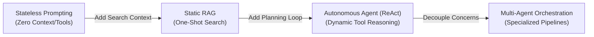

# Production-Grade Agentic Workflows & Multi-Agent Orchestration ⚙️

<div align="center">
  <p><em>The engineering guide to stateful, autonomous, and multi-agent architectures in production.</em></p>
  
  <a href="https://www.python.org"></a>
  <a href="https://www.docker.com"></a>
  <a href="https://github.com/langchain-ai/langgraph"></a>
  <a href="https://github.com/google/generative-ai-python"></a>
  <a href="https://github.com/Arize-AI/phoenix"></a>
  <a href="https://opensource.org/licenses/MIT"></a>
</div>

<br/>

While prototyping basic LLM workflows is straightforward, scaling autonomous systems to production introduces complex software engineering constraints:

1. **Context Expansion & Latency**: Compounding token histories increase inference costs and latency.
2. **State & Concurrency Control**: Complex, cyclic workflows require structured state validation and session synchronization to prevent state corruption or infinite execution loops.
3. **Execution Safety**: Dynamic, agent-initiated tool execution demands containerized compute environments to protect underlying systems.
4. **Telemetry & Tracing**: Non-deterministic agent trajectories require standardized execution traces for performance inspection and debugging.

This repository provides reference architectures, implementation labs, and capstones for building stateful, multi-agent systems, focusing on runtime optimization, state persistence, and systematic evaluation.


---

## 📑 Table of Contents
- [The Production Agent Gap](#the-production-agent-gap)
- [Architectural Paradigm Matrix](#architectural-paradigm-matrix)
- [Prerequisites & Environment Setup](#prerequisites--environment-setup)
- [Curriculum Syllabus](#curriculum-syllabus)
  - [Theory: Chapters](#theory-chapters)
  - [Practice: Labs](#practice-labs)
  - [Mastery: Capstone Projects](#mastery-capstone-projects)
- [Enterprise Tooling Stack](#enterprise-tooling-stack)
- [Contributing](#contributing)
- [License](#license)


---

## 🏗️ The Production Agent Gap

Modern AI engineering requires a transition from stateless prompting to stateful cyclic workflows and specialized multi-agent teams. 



By adding a stateful planning loop, persistent memory checkpointers, and isolated worker boundaries, we upgrade fragile chains into resilient systems that can self-reflect, plan, and gracefully recover from execution errors.

---

## 📊 Architectural Paradigm Matrix

| Paradigm | Primary Limitation | State Scope | Concurrency Safety | Cost Profile | Production Reliability |
| :--- | :--- | :--- | :--- | :--- | :--- |
| **Stateless Prompting** | Lacks iteration, cannot correct intermediate logic errors. | None (Stateless) | N/A (Atomic) | Low (Fixed) | High (But limited capability) |
| **Static RAG** | Passive lookup; fails if search terms are suboptimal. | Single Query | N/A | Low-Medium | Medium-Low (Prone to retrieval noise) |
| **Autonomous Agent (ReAct)** | Attention degradation, tool hallucination, infinite loops. | Local Loop | Low (Requires session locks) | High (Compounding prefill tokens) | Low (Hard to predict/assert) |
| **Multi-Agent Systems** | High coordination latency, complex state merges. | Decoupled / Shared Graph | High (Via isolated actor queues) | Optimized (Via cached context & small scopes) | High (Deterministic boundaries & isolated fallbacks) |

---

## 💻 Prerequisites & Environment Setup

To run the labs and capstone projects, your development environment must satisfy:

*   **Python 3.13+** (leveraging modern typing and async primitives)
*   **Docker Desktop** (required for sandbox execution labs and project containment)
*   **LLM Provider API Keys**: Google Gemini (via `GEMINI_API_KEY`), Anthropic (via `ANTHROPIC_API_KEY`), OpenAI (via `OPENAI_API_KEY`)

### Quick Start
```bash
# 1. Clone the repository
git clone https://github.com/FirdowsRahaman/agentic-workflows-masterclass.git
cd agentic-workflows-masterclass


# 2. Establish python environment
python3 -m venv .venv
source .venv/bin/activate
pip install -r requirements.txt

# 3. Initialize verification run (Vanilla ReAct Loop)
cd labs/lab-01-vanilla-react
python agent.py
```

---

## 📚 Course Curriculum

This repository follows a **theory-first, implementation-focused** learning path.


### 📖 Theory: Chapters
*Deep dive into architectural patterns, mathematical mechanics, and engineering design.*

- 📍 **Level 1: Foundations of Agentic Reasoning**
  - [Chapter 1: Defining the Agent Paradigm](chapters/01-defining-the-agent/README.md) — Autonomy boundaries, agentic loops, and context constraints.
  - [Chapter 2: Moving Beyond Static RAG](chapters/02-moving-beyond-rag/README.md) — Resolving retrieval failure modes via active retrieval loops.
  - [Chapter 3: Cognitive Design Patterns](chapters/03-cognitive-patterns/README.md) — Plan-and-Execute, ReAct, and Self-Reflection frameworks.
  - [Chapter 4: Tool Use & Stateless Core](chapters/04-tool-use/README.md) — Structured tool output, timeout handles, and error recovery loops.
- 🏗️ **Level 2: Advanced Orchestration Frameworks**
  - [Chapter 5: Stateful Agent Workflows](chapters/05-stateful-workflows/README.md) — Cyclic state graphs, node transitions, and thread checkpointers.
  - [Chapter 6: Multi-Agent Collaboration Patterns](chapters/06-multi-agent-collaboration/README.md) — Supervisor routing, peer-to-peer choreography, and state boundaries.
  - [Chapter 7: Human-in-the-Loop (HITL)](chapters/07-human-in-the-loop/README.md) — Interrupt conditions, manual state overrides, and time-travel debugging.
  - [Chapter 8: Persistent Memory & Context Management](chapters/08-persistent-memory/README.md) — Episodic vs. semantic memory, associative indexing, and GraphRAG.
- 🏛️ **Level 3: Enterprise-Grade AgentOps**
  - [Chapter 9: Agent Guardrails & Security](chapters/09-guardrails-security/README.md) — Prompt injection defense, PII scrubbing, and sandboxed execution rules.
  - [Chapter 10: Observability & Tracing](chapters/10-observability-tracing/README.md) — Telemetry tracing, span collection, and path auditing (Phoenix/LangSmith).
  - [Chapter 11: Evaluation Pipelines](chapters/11-evaluation-pipelines/README.md) — LLM-as-a-judge patterns, golden evaluation datasets, and deterministic assertions.
  - [Chapter 12: Production Deployment & Serving](chapters/12-deployment-serving/README.md) — Server-Sent Events (SSE), distributed session locking with Redis, and message queues.
  - [Chapter 13: Context Caching & KV-Cache Optimization](chapters/13-context-caching/README.md) — KV attention math, prefix matching constraints, and token billing economics.
  - [Chapter 14: The Future of Agents](chapters/14-future-of-agents/README.md) — Vision/voice loops, local runtimes (Ollama/SLMs), and desktop-automation environments.

### 🔬 Practice: Labs
*Implement core components from scratch to master the low-level mechanics.*

- 🧪 **[Lab 1: The Vanilla ReAct Loop](labs/lab-01-vanilla-react/README.md)** — Implement a complete planning, tool execution, and self-reflection loop in pure Python without framework wrappers.
- 🧪 **[Lab 2: Stateful LangGraph](labs/lab-02-stateful-langgraph/README.md)** — Design cyclic state graphs with node updates, state mergers, and thread-level state restoration.
- 🧪 **[Lab 3: Supervisor Team](labs/lab-03-supervisor-team/README.md)** — Implement a supervisor router that coordinates task delegation, output aggregation, and worker control loops.
- 🧪 **[Lab 4: Human Interruption](labs/lab-04-human-interruption/README.md)** — Pause state graphs before high-risk operations to allow manual validation and state modifications.
- 🧪 **[Lab 5: Dual-Core Memory Engine](labs/lab-05-memory-engine/README.md)** — Build a memory manager coordinating short-term conversational threads alongside long-term semantic embeddings in SQLite.
- 🧪 **[Lab 6: Evals Pipeline](labs/lab-06-evals-pipeline/README.md)** — Configure automated evaluation suites that run test assertions and compute similarity/completeness scores via LLM judges.
- 🧪 **[Lab 7: Corrective RAG (CRAG) Engine](labs/lab-07-agentic-rag/README.md)** — Build an advanced RAG pipeline with document grading, query expansion, and web search fallback routes.
- 🧪 **[Lab 8: Collaborative Agents with Google ADK](labs/lab-08-google-adk/README.md)** — Orchestrate sequential collaborative workflows using Google's Agent Development Kit, exposing custom tools and native MCP server interfaces.

### 🏆 Mastery: Capstone Projects
*Deploy production-ready solutions modeled after enterprise workloads.*

*   💻 **[Autonomous Sandbox Dev Team](projects/project-01-sandbox-dev-team/README.md)**: Build PM, Coder, and QA Tester agents that collaborate, write python scripts, and run automated unit tests inside secure, isolated Docker sandboxes.
*   🏥 **[Clinical Support Agent with HITL](projects/project-02-clinical-agent/README.md)**: Deploy a clinical triage assistant with clinical guidelines RAG, safety policy guardrails, and human escalation checkpoints.
*   📊 **[Collaborative Market Research Engine](projects/project-03-market-research/README.md)**: Build a multi-agent data aggregator, research compiler, and Neo4j GraphRAG explorer that builds structured reports from unstructured documents.
*   🛡️ **[Compliance & Risk Auditor](projects/project-04-compliance-auditor/README.md)**: Architect a regulatory compliance engine that audits PDF financial files, validates outputs against strict Pydantic schemas, and triggers safety filters via Guardrails AI.

---

## 🤝 Enterprise Tooling Stack

*   **[Agent Development Kit (ADK)](https://adk.dev)**: Google's open-source framework for building multi-agent systems and workflows.
*   **[LangGraph](https://github.com/langchain-ai/langgraph)**: Stateful orchestration library of choice for complex state management.
*   **[GenAI SDK](https://github.com/google/generative-ai-python)**: Official library for Google Gemini models.
*   **[Phoenix](https://github.com/Arize-AI/phoenix)**: AI observability and tracing platform.

---

## 🛠️ Contributing

We welcome contributions!
1. Fork the repo and create your feature branch (`git checkout -b feature/AmazingFeature`).
2. Commit your changes (`git commit -m 'Add some AmazingFeature'`).
3. Push to the branch (`git push origin feature/AmazingFeature`).
4. Open a Pull Request.

---

## 📄 License

Distributed under the MIT License. See `LICENSE` for details.

---
<div align="center">
  <sub>Created by <a href="https://github.com/FirdowsRahaman">Firdows Rahaman</a></sub>
</div>
