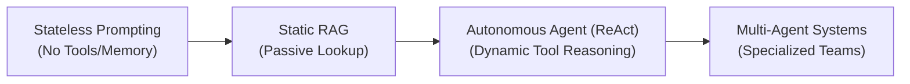

# Agentic Workflows & Multi-Agent Orchestration Masterclass 🎓

<div align="center">
  <p><em>The definitive guide to building stateful, autonomous, and multi-agent AI systems in production.</em></p>
  
  
  
  
  
</div>

<br/>

Building simple LLM applications with single prompts or static chains is easy, but they break when facing real-world complexity. This repository takes you from **basic cognitive patterns** up to **stateful cyclic graphs, multi-agent hierarchies, memory architectures, and production-grade AgentOps**.

This course serves as the direct sequel to the **MCP Masterclass**, showing you how to build the brain that orchestrates external tools and resources.

---

## 📑 Table of Contents
- [Why This Masterclass?](#-why-this-masterclass)
- [LLM & RAG Evolution](#-llm--rag-evolution)
- [Prerequisites & Quick Start](#-prerequisites--quick-start)
- [Curriculum Syllabus](#-curriculum-syllabus)
  - [Theory: Chapters](#-theory-chapters)
  - [Practice: Labs](#-practice-labs)
  - [Mastery: Capstone Projects](#-mastery-capstone-projects)
- [Recommended Frameworks](#-recommended-frameworks)
- [Contributing](#-contributing)
- [License](#-license)

---

## 🌟 Why This Masterclass?

- 🧠 **Dynamic Planning**: Learn how agents plan, self-reflect, and decompose complex tasks.
- 🔁 **Cyclic State Machines**: Master `LangGraph` to handle loops, retries, and persistent agent memories.
- 👥 **Multi-Agent Orchestration**: Connect specialized agents in hierarchical supervisor or peer networks.
- 🛡️ **Production AgentOps**: Set up enterprise observability, guardrails, and rigorous evaluation pipelines.

---

## 🧠 LLM & RAG Evolution

Modern AI architecture has evolved to handle increasingly complex reasoning tasks. Agents bridge the gap between static LLM knowledge and real-world utility:



By adding a stateful planning loop and custom memory, Agents solve major limitations of previous paradigms:
1. **Stateless LLM Limits**: Solves context drift, lack of iteration, and inability to correct intermediate logic errors.
2. **Static RAG Limits**: Upgrades passive retrieval to active retrieval, where the agent reformulates queries, evaluates search hits, and loops until it finds the correct answer.

---

## 💻 Prerequisites & Quick Start

To run the labs and projects, you will need:

- **Python 3.13+** installed.
- **Docker** (needed for sandboxed execution labs/projects).
- API keys for LLM providers (e.g. Google Gemini, Anthropic, OpenAI).

### Quick Start
```bash
# 1. Clone this repository
git clone https://github.com/your-username/agent-orchestration-masterclass.git
cd agent-orchestration-masterclass

# 2. Install dependencies
pip install -r requirements.txt

# 3. Try Lab 1 (Vanilla ReAct Loop)
cd labs/lab-01-vanilla-react
python main.py
```

---

## 📚 Curriculum Syllabus

This masterclass is designed around the "Read, Build, Master" approach.

### 📖 Theory: Chapters
*Learn the architectural theory and cognitive patterns.*

- 📍 **Level 1: Foundations of Agentic Reasoning**
  - [Chapter 1: Defining the Agent Paradigm](chapters/01-defining-the-agent/README.md) — Core definition, autonomy spectrum, and LLM limits.
  - [Chapter 2: Moving Beyond Static RAG](chapters/02-moving-beyond-rag/README.md) — Retrieval failures and active retrieval loops.
  - [Chapter 3: Cognitive Design Patterns](chapters/03-cognitive-patterns/README.md) — ReAct, Plan-and-Execute, Self-Reflection.
  - [Chapter 4: Tool Use & Handshaking](chapters/04-tool-use/README.md) — Function calling, timeouts, and error handling.
- 🏗️ **Level 2: Advanced Orchestration Frameworks**
  - [Chapter 5: Stateful Agent Workflows](chapters/05-stateful-workflows/README.md) — LangGraph state, cyclic vs acyclic routing.
  - [Chapter 6: Multi-Agent Collaboration Patterns](chapters/06-multi-agent-collaboration/README.md) — Supervisors, peer-to-peer, and routers.
  - [Chapter 7: Human-in-the-Loop (HITL)](chapters/07-human-in-the-loop/README.md) — State interruption, debugging, and time-travel.
  - [Chapter 8: Persistent Memory & Context](chapters/08-persistent-memory/README.md) — Semantic, episodic, procedural memory & GraphRAG.
- 🏛️ **Level 3: Enterprise-Grade AgentOps**
  - [Chapter 9: Agent Guardrails & Security](chapters/09-guardrails-security/README.md) — Input/output filtering and injection defense.
  - [Chapter 10: Observability & Tracing](chapters/10-observability-tracing/README.md) — Evaluation and path tracking (LangSmith/Phoenix).
  - [Chapter 11: Evaluation Pipelines](chapters/11-evaluation-pipelines/README.md) — LLM-as-a-judge and ground truth assertions.
  - [Chapter 12: Production Deployment](chapters/12-deployment-serving/README.md) — SSE streaming, Redis state, and WebSockets.
  - [Chapter 13: The Future of Agents](chapters/13-future-of-agents/README.md) — Multimodality, local LLMs, and web-navigating agents.

### 🔬 Practice: Labs
*Build core agent components from the ground up.*

- 🧪 [Lab 1: The Vanilla ReAct Loop](labs/lab-01-vanilla-react/README.md) — Build an agent from scratch in pure Python without frameworks.
- 🧪 [Lab 2: Stateful LangGraph](labs/lab-02-stateful-langgraph/README.md) — Set up cyclic state transitions and node memory.
- 🧪 [Lab 3: Supervisor Team](labs/lab-03-supervisor-team/README.md) — Build an orchestrator agent routing tasks to sub-agents.
- 🧪 [Lab 4: Human Interruption](labs/lab-04-human-interruption/README.md) — Halt critical actions for user review.
- 🧪 [Lab 5: Dual-Core Memory Engine](labs/lab-05-memory-engine/README.md) — Maintain semantic memory alongside long-term storage.
- 🧪 [Lab 6: Evals Pipeline](labs/lab-06-evals-pipeline/README.md) — Automate agent grading via LLM judges.

### 🏆 Mastery: Capstone Projects
*Full-scale projects simulating complex enterprise workloads.*

- 💻 **[Autonomous Sandbox Dev Team](projects/project-01-sandbox-dev-team/README.md)** — Coder, Product Manager, and Tester agents collaborating to code and run tests in a Docker sandbox.
- 🏥 **[Clinical Support Agent with HITL](projects/project-02-clinical-agent/README.md)** — Medical triage assistant with guidelines RAG, safety check, and clinical escalation.
- 📊 **[Collaborative Market Research Engine](projects/project-03-market-research/README.md)** — Multi-agent researcher, compiler, and Neo4j GraphRAG generator.
- 🛡️ **[Compliance & Risk Auditor](projects/project-04-compliance-auditor/README.md)** — Automated regulatory PDF auditing with strict Guardrails AI verification.

---

## 🤝 Recommended Frameworks

- **[LangGraph](https://github.com/langchain-ai/langgraph)**: Orchestration engine of choice for complex state management.
- **[GenAI SDK](https://github.com/google/generative-ai-python)**: Official library for Google Gemini models.
- **[Phoenix](https://github.com/Arize-AI/phoenix)**: AI observability and tracing platform.

---

## 🛠️ Contributing

We welcome contributions!
1. Fork the repo and create your feature branch (`git checkout -b feature/AmazingFeature`).
2. Commit your changes (`git commit -m 'Add some AmazingFeature'`).
3. Push to the branch (`git push origin feature/AmazingFeature`).
4. Open a Pull Request.

---

## 📄 License

Distributed under the MIT License. See `LICENSE` for details.

---
<div align="center">
  <sub>Created by <a href="https://github.com/FirdowsRahaman">Firdows Rahaman</a></sub>
</div>
