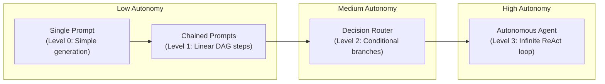

# Chapter 1: Defining the Agent Paradigm 🧠

Welcome to the first chapter of the **Agentic Workflows & Multi-Agent Orchestration Masterclass**. In this chapter, we will define what an "Agent" actually is, look at the spectrum of autonomy, and examine the core reasons why we need agentic systems by exploring the fundamental limitations of raw LLMs.

---

## 📑 Chapter Outline
- [What is an AI Agent?](#-what-is-an-ai-agent)
- [The Autonomy Spectrum](#-the-autonomy-spectrum)
- [Why We Need Agents: Overcoming LLM Limitations](#-why-we-need-agents-overcoming-llm-limitations)
- [Summary & Key Takeaways](#-summary--key-takeaways)

---

## 🤖 What is an AI Agent?

In the context of modern generative AI, an **Agent** is an LLM-backed system that goes beyond simple input-output mapping. Instead of a single static response, an agent uses a loop to:
1. **Perceive** an input or environment state.
2. **Plan** a sequence of actions or think step-by-step.
3. **Execute** actions using external tools (APIs, databases, web search).
4. **Evaluate** the outcome of the action and decide whether to stop or continue.

### The Core Agent Formula

An Agent can be mathematically or conceptually represented as:

$$\text{Agent} = \text{LLM (Reasoning Engine)} + \text{Planning Loop} + \text{Memory} + \text{Tools}$$

- **LLM**: The core reasoning engine. It understands language, makes decisions, and parses tool responses.
- **Planning Loop**: The control structure (e.g., ReAct, Plan-and-Execute) that keeps the system running in a loop until the goal is met.
- **Memory**: The ability to persist state across turns (episodic memory) and retain user/system context (semantic and procedural memory).
- **Tools**: External capabilities that the LLM can invoke to interact with the real world (using standards like the **Model Context Protocol**).

---

## 📈 The Autonomy Spectrum

Autonomy is not binary; it is a spectrum. As developers, we choose where on this spectrum our system should reside based on safety, predictability, and task complexity.

1. **Single Prompt (Level 0 - Zero Autonomy)**
   - Input goes in, model outputs a completion, process terminates.
   - Example: *"Write an email template for marketing."*
2. **Prompt Chains (Level 1 - Low Autonomy)**
   - A sequential, linear flow of prompt steps. Step B depends on the output of Step A.
   - Example: Summarize text $\rightarrow$ Translate summary $\rightarrow$ Generate tweet.
3. **Decision Routers (Level 2 - Medium Autonomy)**
   - The model selects one of several static paths to execute based on input classification.
   - Example: Customer support query $\rightarrow$ LLM classifies as billing or technical $\rightarrow$ Routes to hardcoded billing pipeline.
4. **Autonomous Agents (Level 3 - High Autonomy)**
   - The model determines the steps, selects the tools, inspects the tools' output, and self-corrects until the user's objective is met.
   - Example: *"Research competitors in the AI space and compile a report."* (The LLM searches, reads articles, runs follow-up searches, and compiles the report dynamically).

---

## ⚖️ The 2026 Agent Engineering Discipline: Measure Before Scaling

In 2026, the industry standard for agent design prioritizes cost-efficiency and predictability, stabilizing around a strict progression workflow:

1. **Start with a Single-Agent ReAct Baseline**: Always build a single-agent system first. Never jump straight to multi-agent topologies unless single-agent performance hits a ceiling.
2. **Beware Coordination Overhead**: Multi-agent setups (such as Supervisor-Worker or Choreography) introduce significant coordination costs:
   - **Increased Latency**: Every inter-agent handoff requires a full LLM inference turn.
   - **Cost Accumulation**: Multiple LLM routing steps quickly exhaust token budgets.
   - **Debugging Complexity**: Troubleshooting state propagation across nested graphs is significantly harder.
3. **Bound Agent Autonomy**: Never allow an agent to run with open-ended execution limits. Production agents require **Bounded Execution** parameters (maximum recursion depth, maximum token spend per session, and mandatory human interrupts).

---

## 🛡️ Why We Need Agents: Overcoming LLM Limitations

While frontier LLMs are incredibly powerful, they suffer from fundamental limitations when used as stateless text-completion engines:

### 1. The Stateless Limitation (No Memory)
- **The Problem**: Raw LLMs have no persistent state. Each API call is a brand new transaction. The model has no recollection of past interactions unless you manually feed the entire chat history back into the context window.
- **The Agent Solution**: Stateful frameworks manage memory layers dynamically, writing execution logs and user interactions into external databases (Redis, Postgres) to maintain state across long-running sessions.

### 2. The Sandbox Limitation (No Tooling)
- **The Problem**: LLMs are isolated brains. A raw LLM cannot search the web, query a database, compile code, or send an email. It only knows what was present in its training dataset.
- **The Agent Solution**: Function calling interfaces allow the LLM to output structured JSON representing an action. The agent runtime intercepts this JSON, executes the code, and returns the result to the LLM.

### 3. The Lack of Planning (No Reflection)
- **The Problem**: LLMs produce text token-by-token. They cannot "pause" to draft an outline, rethink their approach, or correct a mistake once a token is generated. They generate the most probable next token, even if it leads to a logical dead end.
- **The Agent Solution**: ReAct loops and Self-Reflection frameworks force the LLM to think first (`Thought`), execute an action (`Act`), observe the result (`Observation`), and critique its own work before generating the final answer.

---

## 📝 Summary & Key Takeaways

- **Agents** are active orchestrators, not passive responders.
- The core architecture relies on an **LLM** acting as the brain, guided by a **planning loop**, equipped with **memory**, and connected to **tools**.
- Move up the **autonomy spectrum** only when necessary: dynamic loops are powerful but introduce latency, cost, and unpredictability compared to static chains.

---

## 🏁 What's Next?
In **[Chapter 2: Moving Beyond Static RAG](../02-moving-beyond-rag/README.md)**, we will explore the specific failures of traditional Retrieval-Augmented Generation and look at how agentic design patterns transform passive search into intelligent research.
