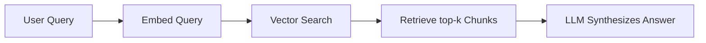
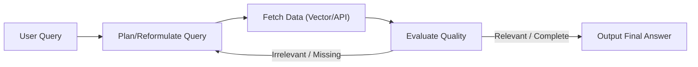

# Chapter 2: Moving Beyond Static RAG 🔍

In this chapter, we explore how the agentic paradigm enhances search. We will analyze the severe structural limitations of standard, passive Retrieval-Augmented Generation (RAG) systems and show how active agentic loops resolve these problems to build resilient, state-of-the-art information retrieval systems.

---

## 📑 Chapter Outline
- [The RAG Paradigm Shift](#-the-rag-paradigm-shift)
- [Limitations of Standard (Static) RAG](#-limitations-of-standard-static-rag)
- [How Agents Fix RAG: Active Retrieval](#-how-agents-fix-rag-active-retrieval)
- [Agentic RAG Architectural Patterns](#-agentic-rag-architectural-patterns)
- [Summary & Key Takeaways](#-summary--key-takeaways)

---

## 🔄 The RAG Paradigm Shift

Traditional RAG was a massive leap forward, allowing models to answer questions using private data without retraining. However, traditional RAG is **passive** and **linear**:

There is no validation step. If the retriever fetches bad chunks, or if the user's query is poorly phrased, the model simply receives garbage and hallucinates a plausible-sounding but incorrect answer.

---

## ⚠️ Limitations of Standard (Static) RAG

Static RAG systems fail in predictable ways when confronted with real-world enterprise documents:

### 1. Passive "One-Shot" Retrieval
- **The Failure**: The system retrieves documents exactly *once*. If the retrieved documents do not contain the answer, or only contain part of it, the LLM has to make do with what it got. It cannot ask for more information or modify the search query.
- **Example**: *"Compare our Q3 revenue growth to Q3 of last year."* If the retriever only pulls Q3 reports from this year, the LLM cannot answer the comparative question.

### 2. Semantic Mismatch (Word Salad Search)
- **The Failure**: Vector search relies on cosine similarity of text embeddings. If the query uses different terminology or phrasing than the stored document (e.g., query uses *"how to reset password"* but the document says *"credentials renewal procedures"*), the vector search might miss it entirely.

### 3. The "Lost in the Middle" Phenomenon
- **The Failure**: Context windows have grown, but LLM attention is not uniform. If you retrieve the top-20 document chunks (say 15,000 tokens) and feed them to the LLM, the model tends to ignore information in the middle of the context, focusing only on the beginning and end.

### 4. Multi-Hop Reasoning Failure
- **The Failure**: Complex questions require connecting multiple disparate facts.
- **Example**: *"Who is the CEO of the company that acquired Acme Corp in 2024?"* A static RAG query for this will fail because the system needs to first search for *"who acquired Acme Corp in 2024"*, read the answer (e.g., *"Beta Corp"*), and then run a second search for *"who is the CEO of Beta Corp"*.

---

## 🛠️ How Agents Fix RAG: Active Retrieval

Agentic RAG replaces the rigid linear pipeline with an iterative, self-correcting loop. The agent acts as an active search coordinator:

By putting the LLM in charge of the retrieval loop, we gain several critical features:

### 1. Query Reformulation & Expansion
The agent analyzes the user's messy query and writes multiple optimized search queries to query the vector database or search engine, matching the terminology of the underlying corpus.

### 2. Self-Correction & Relevance Grading
After fetching chunks, the agent evaluates them:
- *"Does this chunk actually answer the user's question?"*
- *"Is there a hallucination in the generated response based on these source chunks?"*
If the evaluation fails, the agent discards the chunk, rewrites the query, and searches again.

### 3. Multi-Hop Routing
For complex queries, the agent breaks the problem down into steps, retrieves the answer for Step 1, updates its state, and then fetches details for Step 2.

---

## 🏛️ Agentic RAG Architectural Patterns

When building Agentic RAG, we utilize three main patterns:

1. **Routing Agents**: The LLM classifies the incoming query and decides whether to send it to a Vector Database, a Graph Database (GraphRAG), a SQL Database, or an external search API.
2. **Corrective RAG (CRAG)**: A pattern where a separate evaluator agent grades the retrieved documents. if the quality is low, the agent spins up a web-search tool to find external grounding documents.
3. **Self-RAG**: An architecture where the model generates reflection tokens (`[Retrieval]`, `[Relevance]`, `[Utility]`) to dynamically decide when to retrieve documents and critique the generated outputs.

---

## 📝 Summary & Key Takeaways

- **Static RAG** is limited by its rigid, one-shot retrieval structure.
- **Agentic RAG** introduces planning, evaluation, and iteration, enabling multi-hop reasoning and active self-correction.
- Utilizing **Evaluator nodes** to grade document relevance before generating text prevents hallucinations.

---

## 🏁 What's Next?

Put theory into practice:
- 🧪 **[Lab 7: Corrective RAG (CRAG) Engine](../../labs/lab-07-agentic-rag/README.md)** — Build document grading, query expansion, and web search fallback in a LangGraph-style pipeline.

After completing the lab, proceed to **[Chapter 3: Cognitive Design Patterns](../03-cognitive-patterns/README.md)**, where we will build the core planning mechanisms of agents using standard ReAct (Reason + Action) loops.
