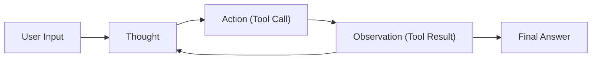
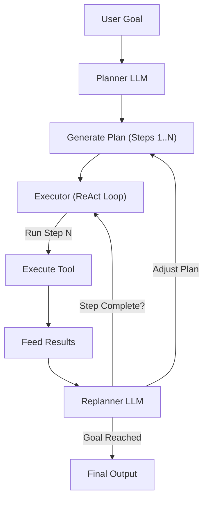
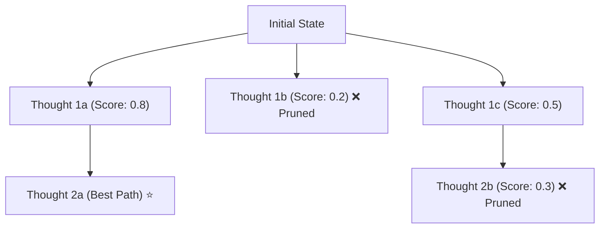
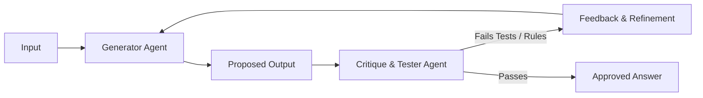

# Chapter 3: Cognitive Design Patterns 🧩

In this chapter, we explore how agents plan, reason, and make choices. We will dive deep into the classic ReAct (Reason + Action) loop and investigate advanced planning structures like Plan-and-Execute, Tree of Thoughts, and Self-Reflection/Critique loops.

---

## 📑 Chapter Outline
- [The ReAct Pattern](#-the-react-pattern)
- [Plan-and-Execute Pattern](#-plan-and-execute-pattern)
- [Tree of Thoughts (ToT)](#-tree-of-thoughts-tot)
- [Self-Reflection & Critique loops](#-self-reflection--critique-loops)
- [LLM Compiler Architecture](#-llm-compiler-architecture)
- [Summary & Key Takeaways](#-summary--key-takeaways)

---

## 🔁 The ReAct Pattern

The **ReAct (Reason + Action)** pattern, introduced by Yao et al. in 2022, is the foundation of modern agentic workflows. By prompting the LLM to generate both *reasoning traces* and *action details* in an alternating fashion, the agent's reasoning ability is dynamically coupled with external tools.

### The ReAct Execution Loop

For each turn, the agent follows a structured sequence:

1. **Thought**: The agent reflects on the current state and decides what step to take next.
2. **Action**: The agent selects a specific tool and constructs its input arguments (usually outputting a JSON block).
3. **Observation**: The runtime environment executes the selected tool and returns the text results back to the agent.
4. **Repeat**: The loop continues until the agent generates a final answer to the user.

### Why write "Thoughts" down?
If the agent goes straight to the action without reasoning first, it is much more likely to make logical errors or pass incorrect inputs to tools. Writing down thoughts mimics human planning and allows the LLM to build a step-by-step logical sequence in its generation history.

---

## 🗺️ Plan-and-Execute Pattern

While the ReAct loop is excellent for quick exploration, it suffers from a lack of foresight on complex tasks. It makes step-by-step decisions, but can easily lose track of the larger goal.

The **Plan-and-Execute** pattern separates planning from execution:

1. **Planner**: An LLM is asked to output a list of steps required to achieve the goal.
2. **Executor**: A simpler ReAct agent takes each step and executes it using the available tools.
3. **Replanner**: A supervising LLM reviews the execution results of each step, marks steps as complete, and adjusts the remaining plan if obstacles are encountered.

This separation of concerns results in highly stable, long-running agent workflows.

---

## 🌳 Tree of Thoughts (ToT)

For tasks requiring strategic exploration, search, or lookahead (like coding, complex math, or planning itineraries), linear generation is insufficient. **Tree of Thoughts** allows the agent to evaluate multiple candidate actions at each step:

- **Candidate Generation**: The LLM proposes multiple possible next thoughts/actions.
- **Evaluation**: An LLM-as-a-judge scores the validity/viability of each candidate.
- **Search Algorithm**: A classic search algorithm (like Depth-First Search or Breadth-First Search) traverses the generated tree, pruning low-scoring branches and backtracking when it hits a dead end.

---

## 🔍 Self-Reflection & Critique Loops

A reflection loop is a simple state machine where a generator agent's output is checked by a critique agent:

- **Generator**: Drafts the answer or code.
- **Critique/Tester**: Runs unit tests, static code analysis, or uses an LLM evaluator to find bugs, omissions, or style violations.
- **Refiner**: If bugs are found, the generator takes the feedback and revisions the code. The loop runs until the critique agent gives approval.

---

## ⚡ LLM Compiler Architecture

The **LLM Compiler** is an optimization pattern designed to minimize LLM latency. In typical ReAct agents, tool execution is sequential. If three tools need to run (e.g., fetching 3 different stock prices), it takes 3 round-trips.

An LLM Compiler works by:
1. **Planner**: Outputting a Directed Acyclic Graph (DAG) of tool calls, identifying which tools can run in *parallel*.
2. **Task Director**: Running non-dependent tool calls concurrently.
3. **Joiner**: Gathering all parallel outputs and deciding if additional planning is required.

---

## 📝 Summary & Key Takeaways

- **ReAct** couples reasoning with action, forming the fundamental loop of autonomous agents.
- **Plan-and-Execute** decouples high-level macro planning from execution, increasing system predictability.
- **Tree of Thoughts** and **Self-Reflection** introduce backtracking and error correction capabilities.
- **LLM Compilers** optimize execution latency by executing independent tasks in parallel.

---

## 🏁 What's Next?
In **[Chapter 4: Tool Use & Handshaking](../04-tool-use/README.md)**, we will examine the protocol layer: how models interact with APIs, handle schema matching, and recover from real-world communication errors.
