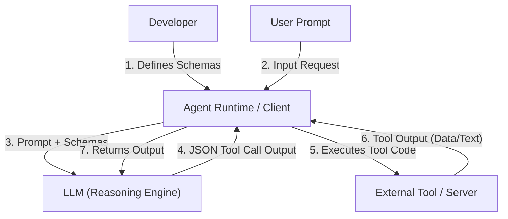
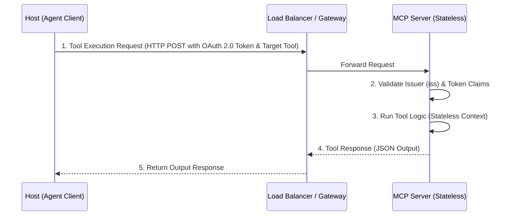
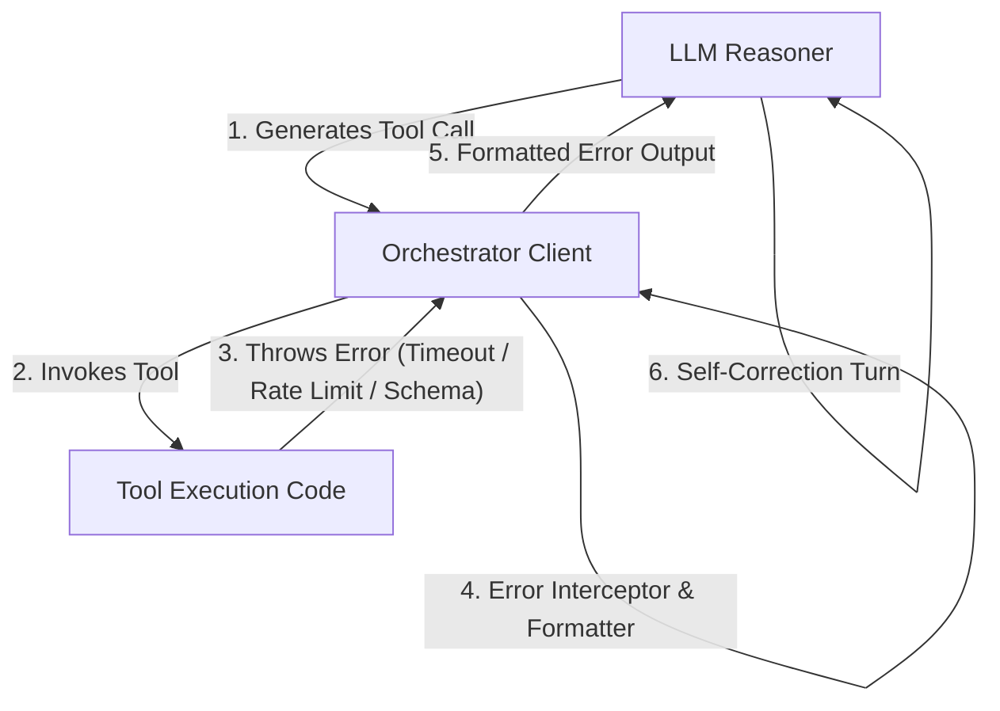

# Chapter 4: Tool Use & Stateless Core 🛠️

In this chapter, we inspect the mechanical plumbing of agent tool use. We will dive into how function calling works under the hood, how the handshaking protocol works between client and server runtimes, and how to write resilient agents that gracefully handle real-world API errors, timeouts, and output limits.

---

## 📑 Chapter Outline
- [Function Calling Under the Hood](#function-calling-under-the-hood)
- [Model Context Protocol (Stateless Core & Extensions)](#model-context-protocol-stateless-core--extensions)
- [Common Tool Failures & Mitigation](#common-tool-failures--mitigation)
- [Handling Large Tool Outputs & Truncation](#handling-large-tool-outputs--truncation)
- [Summary & Key Takeaways](#summary--key-takeaways)


---

## 🔌 Function Calling Under the Hood

LLMs cannot run Python code or fetch URLs directly. Instead, modern models are trained to output special structured sequences (usually JSON format) representing a function call when their system prompt tells them that tools are available.

### The Function Call Cycle



### JSON Schema Structure
The tool definition requires a name, a description (critical because the LLM uses it to determine *when* to invoke the tool), and a parameters block structured as a JSON schema. Here is an example schema:

```json
{
  "name": "calculate_tax",
  "description": "Calculates sales tax based on price and state code.",
  "parameters": {
    "type": "object",
    "properties": {
      "price": { "type": "number", "description": "The subtotal amount." },
      "state": { "type": "string", "description": "2-letter US state code." }
    },
    "required": ["price", "state"]
  }
}
```

---

---

## 🤝 Model Context Protocol (Stateless Core & Extensions)

> [!IMPORTANT]
> **2026 Specification Update**: The Model Context Protocol (MCP) has transitioned from a stateful, connection-oriented handshake model to a **Stateless Protocol Core**. MCP now runs on standard, stateless HTTP transport infrastructures, eliminating the need for persistent server-side handshakes or connection locking. This allows MCP servers to be deployed horizontally behind standard load balancers.

### Stateless Communication & Lifecycle
Under the updated specification, the Host (Agent Client) communicates with the MCP Server via stateless request-response payloads. Client requests include headers for authentication and capabilities discovery.



### Key Components of the 2026 Specification
- **Stateless Request Processing**: Session handshakes are bypassed. Every request stands alone, carrying capabilities headers and metadata to route the action.
- **Extensions Framework**: Additional protocol behaviors are managed through modular extensions rather than core specification changes:
  - **MCP Apps**: Enables servers to return rendered user interfaces (UIs) directly to the host client.
  - **Tasks**: A dedicated protocol layer for managing asynchronous, long-running agent workloads.
- **Authorization Hardening**: MCP integrations strictly require OAuth 2.0 or OpenID Connect token validations, with mandatory checks on the `iss` (issuer) parameter to prevent spoofing and authorization bypasses.

---

## ⚠️ Common Tool Failures & Mitigation

Production agents must expect tools to fail. Here is how the orchestrator intercepts exceptions and loops back to allow LLM self-correction:



### 1. JSON Parsing & Schema Errors

- **The Problem**: The LLM outputs malformed JSON or omits required fields in the tool arguments.
- **Mitigation**: Catch validation errors in the agent runtime, wrap the error message, and send it back to the LLM as a tool output. For example: *"Error: Missing required parameter 'state'. Please try calling calculate_tax again with 'state'."* The LLM will inspect the error and self-correct.

### 2. Tool Execution Timeouts
- **The Problem**: A database query or web scraper tool hangs indefinitely, locking the agent loop.
- **Mitigation**: Implement strict timeouts (e.g., 5-10 seconds max) at the runtime layer. If a tool exceeds the timeout, raise a `TimeoutError`, return a clean message to the LLM, and log it for tracing.

### 3. API Rate Limiting
- **The Problem**: The tool throws HTTP 429 Rate Limit Exceeded.
- **Mitigation**: Implement exponential backoff retry logic inside the tool code itself, hiding the rate-limiting complexity from the LLM, or return a payload advising the LLM to sleep and retry.

---

## ✂️ Handling Large Tool Outputs & Truncation

A common error is passing a massive database or API response directly back to the LLM, exhausting the context window or spiking token costs:

- **The Problem**: Scraped web page is 200,000 tokens, but your model only supports 32,000 tokens.
- **Mitigation Patterns**:
  1. **Truncation with Summary**: Truncate the text, append a warning, and ask a helper model to summarize the response.
  2. **Pagination**: Implement cursor-based pagination parameters on the tool. Let the agent decide to fetch `page_number: 2` if it needs more info.
  3. **File Resources**: Save large outputs to a local file resource and return only the file path and schema summary to the LLM. The LLM can then use specialized read/search tools to query specific chunks of the file.

---

## 📝 Summary & Key Takeaways

- The **Model Context Protocol (MCP)** provides a stateless, vendor-neutral interface backed by the Linux Foundation's **Agentic AI Foundation (AAIF)** to securely connect client orchestrators to remote tool servers.
- Build defensive agent runtimes: handle JSON parsing, timeouts, and output limits at the code layer, and leverage the LLM's reasoning loop to correct schema errors.

---

## 🏁 What's Next?
In **[Chapter 5: Stateful Agent Workflows](../05-stateful-workflows/README.md)**, we shift our attention to Level 2 and learn how to manage long-term agent sessions, define cyclic graphs, and build complex state machines.
