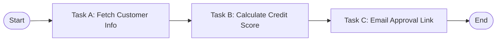
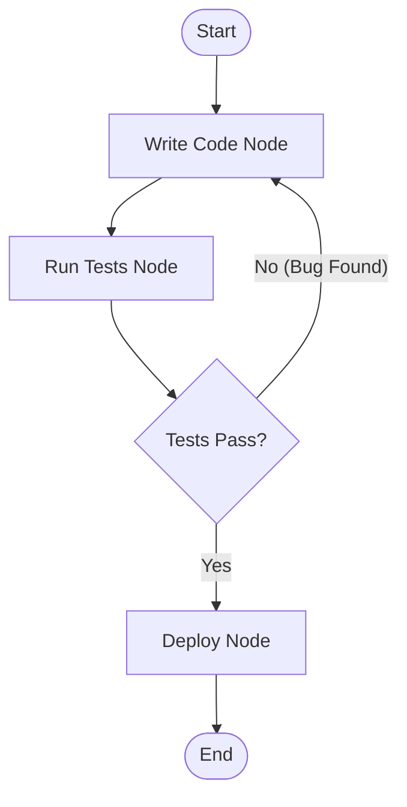
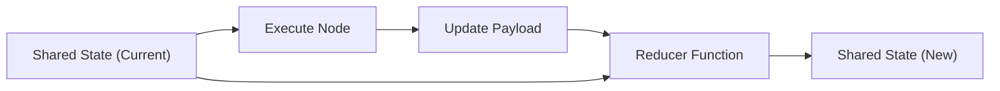
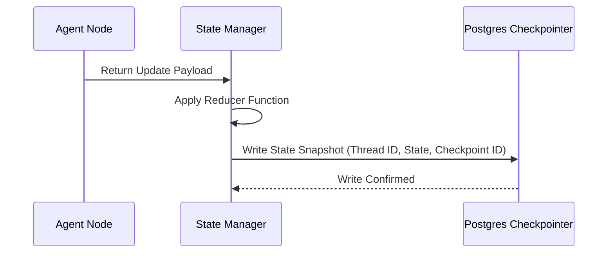

# Chapter 5: Stateful Agent Workflows 🔁

In this chapter, we explore stateful agent architectures. We will analyze why state is the defining requirement for production agents, and compare Directed Acyclic Graphs (DAGs) with Cyclic Graphs to show how state is initialized, updated, and persisted across long-running tasks.

---

## 📑 Chapter Outline
- [Why State Matters](#-why-state-matters)
- [Acyclic (DAGs) vs. Cyclic Graphs](#-acyclic-dags-vs-cyclic-graphs)
- [Managing State: Reducers & Actions](#-managing-state-reducers--actions)
- [Persisting State: Database Checkpointers](#-persisting-state-database-checkpointers)
- [Summary & Key Takeaways](#-summary--key-takeaways)

---

## 💾 Why State Matters

In simple applications, user interaction is stateless: a query goes in, an answer is generated, and the memory is discarded. 

Production agents require **state consistency** for several reasons:
1. **Long-Running Executions**: Complex tasks (like crawling 50 websites or compiling a software project) can take minutes. If the agent hits an API limit, server crash, or network timeout, it must be able to resume from the exact step it left off.
2. **Multi-Turn Interactions**: The agent must maintain memory of past decisions, user confirmations, and tool responses to keep the dialogue coherent.
3. **Transaction Safety**: Agents handling write operations (updating database rows, executing transactions, sending emails) need transaction-safe rollbacks if subsequent steps fail.

---

## 📊 Acyclic (DAGs) vs. Cyclic Graphs

Orchestration engines like LangGraph construct agent workflows as mathematical graphs containing **Nodes** (actions/code) and **Edges** (conditional routing logic).

### 1. Directed Acyclic Graphs (DAGs)
Traditional workflow engines (like Airflow or Prefect) execute tasks in a strict, forward-moving pipeline. There are no loops allowed.

- **Pros**: Extremely predictable, easy to test, and guaranteed to terminate.
- **Cons**: Cannot handle agentic loops. If Task B fails because the database is locked, the pipeline cannot route back to A to try again or ask the LLM to write a new query.

### 2. Cyclic Graphs (Agent Workflows)
Agentic frameworks like `LangGraph` allow cyclic edges, meaning a node can route back to any previous node, including itself, forming a dynamic execution loop.

- **Pros**: Adapts to real-time errors, handles iterative self-reflection, and can loop until a condition is satisfied.
- **Cons**: Risk of infinite loops, higher token cost, and unpredictable termination times.

---

## 🛠️ Managing State: Reducers & Actions

In stateful agent frameworks, the entire state is represented as a single shared data structure (the **State Schema**). 

When nodes run, they output updates. The framework merges these updates into the shared state using **Reducers**:

- **Overwrite Reducer (Default)**: The output of a node replaces the value of a key in the state.
- **Append Reducer**: The output of a node is appended to a list of values (critical for maintaining a running history of `Messages` or `ToolOutputs`).

---

## 🗄️ Persisting State: Database Checkpointers

To prevent state loss when servers restart or connections drop, stateful frameworks use **Checkpointers**. A checkpointer automatically serializes the agent state and saves it to a persistent database (e.g., SQLite, PostgreSQL, Redis) after every node execution.

### Key Capabilities Enabled by Checkpointing:
1. **Thread Isolation**: Separate conversations (threads) run in parallel, each loading its own state snapshot using a unique `thread_id`.
2. **State Replay (Time Travel)**: You can load any past checkpoint ID to inspect the exact variables at step 3, modify the variables, and fork execution down a new path.
3. **Resume on Failure**: If the process crashes during Node 4, the framework automatically queries the latest database checkpoint on boot and resumes from Node 4.

---

## 📝 Summary & Key Takeaways

- **State** is required for long-running, multi-turn, and transaction-safe agent workloads.
- **Cyclic Graphs** enable self-reflection and retries, separating agents from standard linear pipelines (DAGs).
- **Reducers** define how node outputs are merged back into the shared state.
- **Checkpointers** persist agent state to databases, enabling thread isolation, fault-recovery, and time-travel debugging.

---

## 🏁 What's Next?
In **[Chapter 6: Multi-Agent Collaboration Patterns](../06-multi-agent-collaboration/README.md)**, we will scale up from single-agent graphs to multi-agent ecosystems, studying how specialized agents communicate and collaborate to solve complex workloads.
