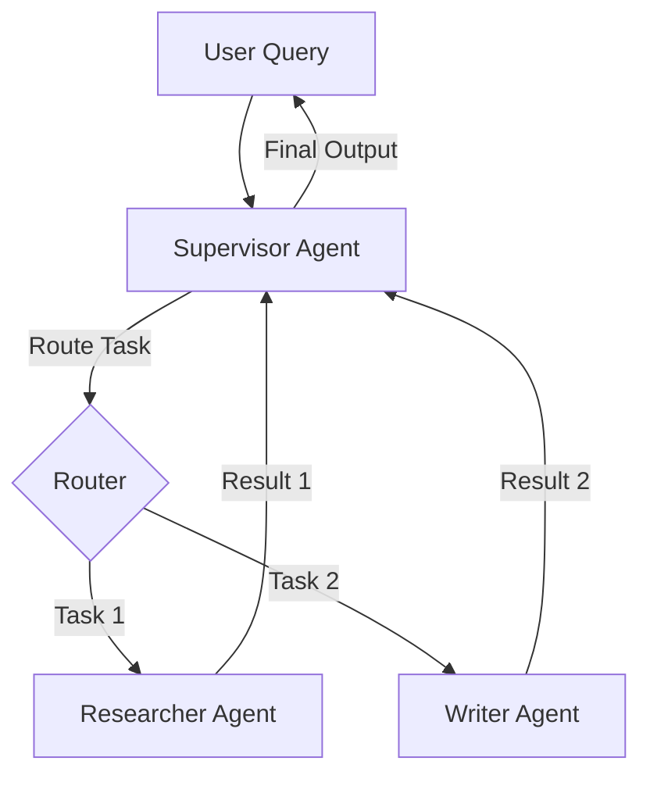
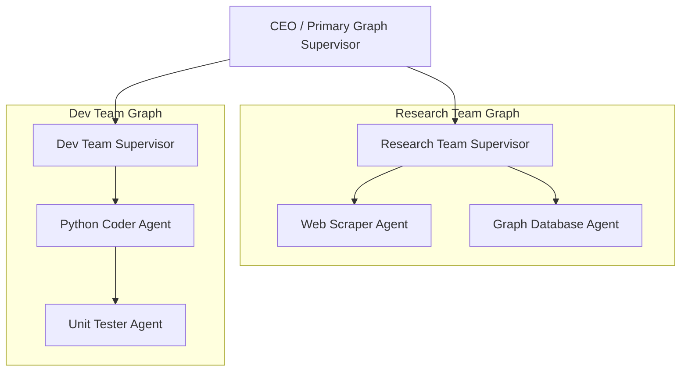

# Chapter 6: Multi-Agent Collaboration Patterns 👥

In this chapter, we explore multi-agent systems. We will compare single-agent and multi-agent designs, analyze core collaboration patterns (Orchestrator-Worker, Hierarchical, Peer-to-Peer), and design strict communication protocols to allow multiple specialized agents to collaborate effectively.

---

## 📑 Chapter Outline
- [Why Multi-Agent?](#-why-multi-agent)
- [Orchestrator-Worker (Supervisor) Pattern](#-orchestrator-worker-supervisor-pattern)
- [Hierarchical Teams Pattern](#-hierarchical-teams-pattern)
- [Peer-to-Peer (Choreography) Pattern](#-peer-to-peer-choreography-pattern)
- [Communication & State Sharing Protocols](#-communication--state-sharing-protocols)
- [Summary & Key Takeaways](#-summary--key-takeaways)

---

## 🆚 Why Multi-Agent?

When a single agent is given too many tools (e.g., 20+ database, web search, file, and code execution tools), its performance degrades rapidly:
- **Context Window Bloat**: Every tool definition uses tokens in the system prompt, driving up cost and latency.
- **Attention Overload**: The LLM struggles to select the correct tool, leading to argument errors and tool hallucinations.
- **System Fragility**: A bug in a tool or node crash halts the entire system.

### Single-Agent vs. Multi-Agent

| Feature | Single-Agent | Multi-Agent |
| :--- | :--- | :--- |
| **Tool Count** | High (All tools exposed) | Low (Each agent has 2-3 specific tools) |
| **System Prompt** | Massively complex | Focused, simple role definition |
| **Debugging** | Difficult (tracing a giant graph) | Easy (isolated sub-graphs/nodes) |
| **Latency & Cost** | Low (single loop) | High (inter-agent communication turns) |

Dividing a large problem into multiple **specialized agents** mimics human organizational structures: a manager supervises, a researcher gathers data, and a coder writes implementation files.

---

## 👑 Orchestrator-Worker (Supervisor) Pattern

In the **Orchestrator-Worker** (or Supervisor) pattern, a central coordinator LLM receives the user request, decides which specialized agent is best equipped to handle the task, delegates the work, and reviews the output.



- **Supervisor**: Has access to zero external tools except for the communication interfaces to delegate tasks to workers.
- **Workers**: Have access to domain-specific tools (e.g., Researcher has Google Search; Writer has File Write). Workers execute their tasks and report back to the Supervisor.

---

## 🏛️ Hierarchical Teams Pattern

For complex workflows, a flat Supervisor model is not enough. We need **Hierarchical Teams**, which nest agent graphs inside other graphs.



In this pattern:
- The CEO agent treats the *Research Team* and *Dev Team* as black-box tools.
- When the Research Team runs, it spins up its own internal sub-graph, executes its loop, and returns a unified report back to the CEO.
- This maintains clean separation of concerns and prevents state variables of one team from polluting another.

---

## 💬 Peer-to-Peer (Choreography) Pattern

In the **Peer-to-Peer (Choreography)** pattern, there is no supervisor. Agents collaborate in a circular or free-form dialogue chain, passing execution states directly to the next agent based on predetermined conditions.


This is highly effective for sequential verification pipelines, such as:
1. Coder agent writes Python script.
2. Code Reviewer agent critiques the code and sends it back to the coder for fixes.
3. Once approved, it is routed to a Security Auditor agent.
4. Security agent inspects it for vulnerabilities and deploys.

---

## 📝 Communication & State Sharing Protocols

For multi-agent systems to function predictably, you must define how agents share data:

### 1. Unified State Sharing
All agents write to and read from a single, shared state graph.
- *Risk*: Workers can overwrite each other's messages or variables, leading to state corruption.

### 2. Isolated State (Context Handoff)
Agents run on independent state graphs and transfer data using strict schemas (e.g., Pydantic models).
- *Benefits*: Clean boundaries, predictable inputs/outputs, and easy testing of individual agents.

```python
from pydantic import BaseModel, Field

class TaskHandoff(BaseModel):
    task_id: str = Field(description="Unique ID for tracing the handoff")
    objective: str = Field(description="Detailed text task for the worker")
    context_data: dict = Field(default_factory=dict, description="Key variables needed")
```

---

## ⚙️ Production Agentic Engineering: Advanced Architectures

Building reliable multi-agent systems in production requires looking past simple routing flows and addressing the core mechanics of memory, state context, token optimization, and tool delegation.

### 1. Context & State Management
In multi-agent systems, state must be securely passed between agents. 
*   **State Serialization**: When Handing off tasks, the output payload of Agent A must be structured (typically using Pydantic schemas) and serialized (JSON) before being injected into Agent B's system prompt or messages list. This enforces data boundaries.
*   **Token Budgeting**: As agents execute in loops, the chat history grows. In production, you must implement **Payload Pruning** (e.g., sliding window limits, summarizing older messages, or filtering out intermediate system/tool messages) to prevent context window bloat and runaway API token costs.

### 2. Memory: Short-Term vs. Long-Term
Memory systems are divided based on persistence and retrieval styles:
*   **Short-Term (Episodic) Memory**: Thread-specific memory tracking the current session's conversation history. It is temporal and discarded when the session ends.
*   **Long-Term (Semantic & Associative) Memory**: Persistent knowledge shared *across* sessions. 
    *   *Semantic Memory* uses vector databases to retrieve facts or user profiles via similarity search.
    *   *Associative Memory* uses Knowledge Graphs (GraphRAG) to reconstruct connections between entities (e.g., linking a customer's workspace, code languages, and deployment history).

### 3. Context Caching
Stateful multi-agent systems suffer from high latency and input costs because the same large system instructions, reference document corpora, or session histories are sent repeatedly to the LLM. 
*   **Prompt Optimization**: By saving the pre-computed attention states (**KV-Cache**) of static prompt prefixes in the provider's GPU memory, context caching reduces latency and token costs by up to **75-90%** (supported by Gemini, Claude, and GPT-4o).

> 📘 **Deep Dive Guide**: For a detailed mathematical and practical breakdown of prefix matching, time-to-live eviction rules, and model provider pricing comparison, see **[Chapter 14: Context Caching & KV-Cache Optimization](../14-context-caching/README.md)**.

### 4. Decoupled Tooling & MCP
In traditional architectures, tools are tightly coupled to the agent framework (e.g., writing a LangChain-specific tool class). In enterprise systems, tools must be decoupled so that any agent running in any environment can invoke them.
*   **Model Context Protocol (MCP)**: An open standard using a client-server architecture. Tools are hosted on an independent **MCP Server** (running locally or in a sandbox container) and exposed via JSON-RPC. 
*   **Framework Agnosticism**: An agent framework (acting as the **MCP Client**) queries the server to list and execute tools. This means a single database tool server can be shared seamlessly between LangGraph, custom Python scripts, AWS Bedrock agents, or Google ADK.

---

### 📊 Multi-Agent Framework Comparison

When selecting an orchestration framework, evaluate how they manage state, memory, and deployment scale:

| Framework | State Management | Memory Lifecycle | Caching & Optimization | Tooling & Integration |
| :--- | :--- | :--- | :--- | :--- |
| **AWS Bedrock Agents** | Managed session state, state tracking abstracted behind APIs. | Built-in conversational memory; long-term vector integrations. | Abstracted; managed dynamically by AWS servers. | Integrates with AWS Lambda functions and OpenAPI schemas. |
| **Anthropic (Custom Python)** | Handcrafted state models, explicit message loops. | Handled via custom databases; developer must build episodic logs. | Supported via Anthropic prompt cache headers. | Standard function calling schemas; native MCP client support. |
| **LangGraph** | Explicit State Graphs with node reducers and cyclic edge routing. | Flexible Checkpointers (in-memory, Redis, PostgreSQL). | Configurable prompt-level headers in node calls. | Supports standard langchain tools and custom python functions. |
| **Google ADK** | Code-first declarative Workflows (Sequential, Parallel, Loop). | Built-in `Session` abstraction for persistent thread management. | Natively optimized for Gemini context caching. | Out-of-the-box MCP integration; tool verification checkpoints. |

---

## 📝 Summary & Key Takeaways

- **Multi-Agent Systems** reduce prompt complexity and tool selection failures by dividing labor among specialized agents.
- **Orchestrator-Worker** relies on a central LLM to route tasks and compile final reports.
- **Hierarchical Teams** nest agent sub-graphs inside parent graphs for maximum encapsulation.
- **Context Caching** is critical in production to minimize latency and token billing in stateful loops.
- **decoupled tooling (MCP)** enables tool reuse across different agent engines.

---

## 🏁 What's Next?

Put theory into practice:
- 🧪 **[Lab 8: Collaborative Agents with Google ADK](../../labs/lab-08-google-adk/README.md)** — Build specialized agents, custom tools, and collaborative sequential workflows using the Google ADK Python SDK.

After completing the lab, proceed to **[Chapter 7: Human-in-the-Loop (HITL)](../07-human-in-the-loop/README.md)** to learn how to pause these workflows for user validation.
