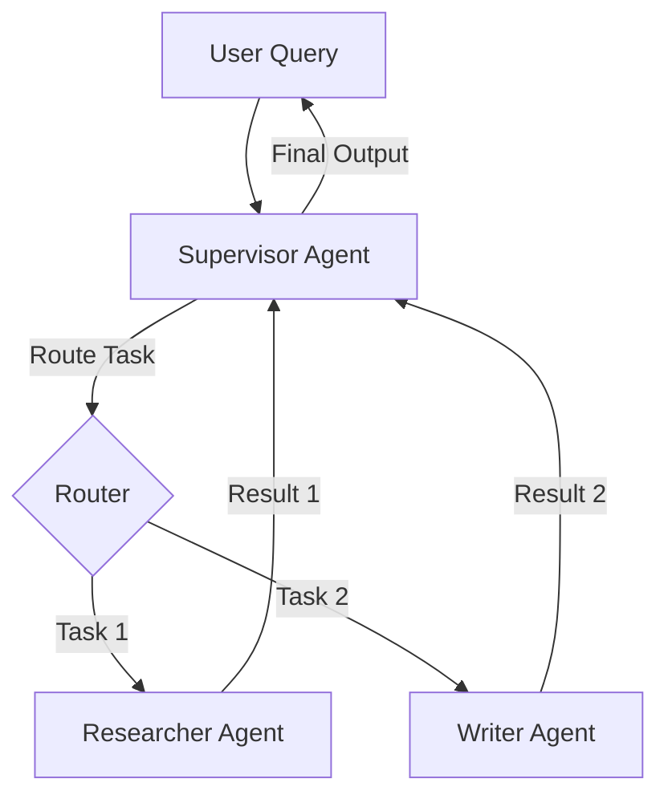
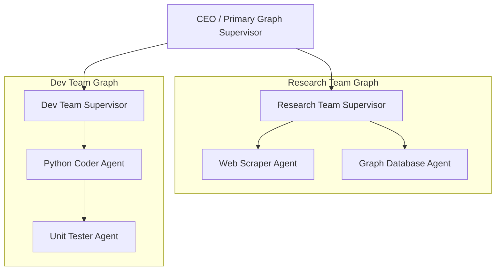
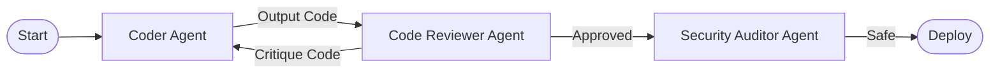

# Chapter 6: Multi-Agent Collaboration Patterns 👥

In this chapter, we explore multi-agent systems. We will compare single-agent and multi-agent designs, analyze core collaboration patterns (Orchestrator-Worker, Hierarchical, Peer-to-Peer), and design strict communication protocols to allow multiple specialized agents to collaborate effectively.

---

## 📑 Chapter Outline
- [Why Multi-Agent?](#-why-multi-agent)
- [Orchestrator-Worker (Supervisor) Pattern](#-orchestrator-worker-supervisor-pattern)
- [Hierarchical Teams Pattern](#-hierarchical-teams-pattern)
- [Peer-to-Peer (Choreography) Pattern](#-peer-to-peer-choreography-pattern)
- [Communication & State Sharing Protocols](#-communication--state-sharing-protocols)
- [Summary & Key Takeaways](#-summary--key-takeaways)

---

## 🆚 Why Multi-Agent?

When a single agent is given too many tools (e.g., 20+ database, web search, file, and code execution tools), its performance degrades rapidly:
- **Context Window Bloat**: Every tool definition uses tokens in the system prompt, driving up cost and latency.
- **Attention Overload**: The LLM struggles to select the correct tool, leading to argument errors and tool hallucinations.
- **System Fragility**: A bug in a tool or node crash halts the entire system.

### Single-Agent vs. Multi-Agent

| Feature | Single-Agent | Multi-Agent |
| :--- | :--- | :--- |
| **Tool Count** | High (All tools exposed) | Low (Each agent has 2-3 specific tools) |
| **System Prompt** | Massively complex | Focused, simple role definition |
| **Debugging** | Difficult (tracing a giant graph) | Easy (isolated sub-graphs/nodes) |
| **Latency & Cost** | Low (single loop) | High (inter-agent communication turns) |

Dividing a large problem into multiple **specialized agents** mimics human organizational structures: a manager supervises, a researcher gathers data, and a coder writes implementation files.

---

## 👑 Orchestrator-Worker (Supervisor) Pattern

In the **Orchestrator-Worker** (or Supervisor) pattern, a central coordinator LLM receives the user request, decides which specialized agent is best equipped to handle the task, delegates the work, and reviews the output.



- **Supervisor**: Has access to zero external tools except for the communication interfaces to delegate tasks to workers.
- **Workers**: Have access to domain-specific tools (e.g., Researcher has Google Search; Writer has File Write). Workers execute their tasks and report back to the Supervisor.

---

## 🏛️ Hierarchical Teams Pattern

For complex workflows, a flat Supervisor model is not enough. We need **Hierarchical Teams**, which nest agent graphs inside other graphs.



In this pattern:
- The CEO agent treats the *Research Team* and *Dev Team* as black-box tools.
- When the Research Team runs, it spins up its own internal sub-graph, executes its loop, and returns a unified report back to the CEO.
- This maintains clean separation of concerns and prevents state variables of one team from polluting another.

---

## 💬 Peer-to-Peer (Choreography) Pattern

In the **Peer-to-Peer (Choreography)** pattern, there is no supervisor. Agents collaborate in a circular or free-form dialogue chain, passing execution states directly to the next agent based on predetermined conditions.



This is highly effective for sequential verification pipelines, such as:
1. Coder agent writes Python script.
2. Code Reviewer agent critiques the code and sends it back to the coder for fixes.
3. Once approved, it is routed to a Security Auditor agent.
4. Security agent inspects it for vulnerabilities and deploys.

---

## 📝 Communication & State Sharing Protocols

For multi-agent systems to function predictably, you must define how agents share data:

### 1. Unified State Sharing
All agents write to and read from a single, shared state graph.
- *Risk*: Workers can overwrite each other's messages or variables, leading to state corruption.

### 2. Isolated State (Context Handoff)
Agents run on independent state graphs and transfer data using strict schemas (e.g., Pydantic models).
- *Benefits*: Clean boundaries, predictable inputs/outputs, and easy testing of individual agents.

```python
from pydantic import BaseModel, Field

class TaskHandoff(BaseModel):
    task_id: str = Field(description="Unique ID for tracing the handoff")
    objective: str = Field(description="Detailed text task for the worker")
    context_data: dict = Field(default_factory=dict, description="Key variables needed")
```

---

## 📝 Summary & Key Takeaways

- **Multi-Agent Systems** reduce prompt complexity and tool selection failures by dividing labor among specialized agents.
- **Orchestrator-Worker** relies on a central LLM to route tasks and compile final reports.
- **Hierarchical Teams** nest agent sub-graphs inside parent graphs for maximum encapsulation.
- **Peer-to-Peer** links agents sequentially, enabling structured verification loops (e.g., Coder $\rightarrow$ Reviewer $\rightarrow$ Auditor).
- Maintain strict **Pydantic schemas** for context handoffs to ensure system robustness.

---

## 🏁 What's Next?
In **[Chapter 7: Human-in-the-Loop (HITL)](../07-human-in-the-loop/README.md)**, we will learn how to pause these multi-agent graphs, stream intermediate states, and request user input before executing sensitive actions.
