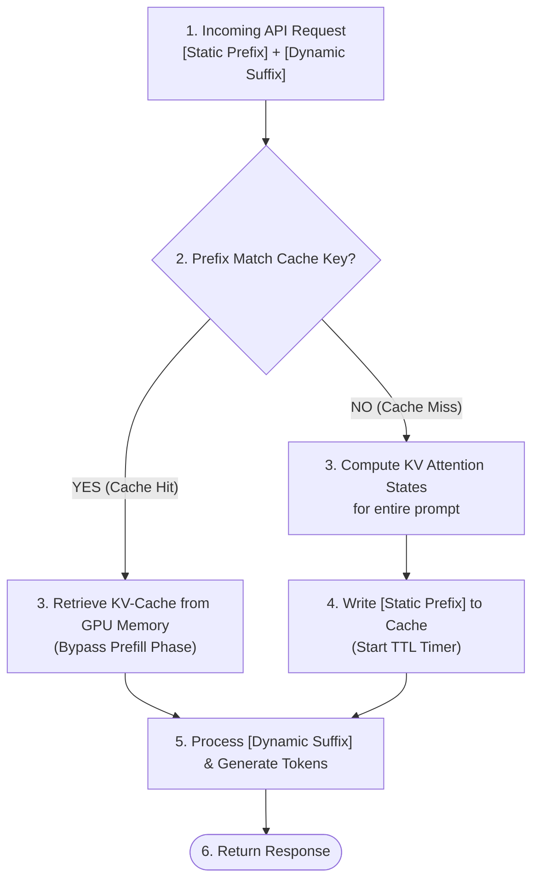

# LLM Context Caching Deep Dive ⚡

In stateful multi-agent systems, the same system instructions, database schemas, API tools, and long chat histories are sent repeatedly to the LLM on every turn. In a production environment, this leads to **runaway input token costs** and **high latency**. 

**Context Caching** solves this bottleneck by storing pre-computed prompt states directly in the model server's memory.

---

## 🎨 Architectural Overview

Below is the conceptual architecture of how context caching optimizes stateful multi-agent loops:

---

## ⚙️ How it Works Under the Hood

### 1. Bypassing the Prefill Bottleneck
Every LLM inference call consists of two main phases:
*   **Prefill Phase**: The model processes the input prompt and calculates Key-Value (KV) attention states for every token. For large context sizes (e.g., a 100k-token repository codebase or reference PDF), the prefill phase is slow and dominates **Time-to-First-Token (TTFT)** latency.
*   **Decoding Phase**: The model generates response tokens one-by-one.

**Context Caching** caches the pre-computed **KV-Cache** states in the provider's high-speed memory. When a cached prompt is hit, the model server completely bypasses the prefill phase calculations for the cached tokens.

### 2. Strict Prefix Matching
To trigger a cache hit, the prompt must satisfy **Strict Prefix Matching**:
*   The cached block must start at the absolute beginning of the prompt (token index `0`).
*   The cached tokens must match character-for-character (including whitespace, system instructions, and tool definitions).
*   As soon as a dynamic variable (like a user query or a new chat message) is appended, the cache boundary ends. The model server retrieves the cached KV-cache for the prefix and computes attention states only for the new dynamic suffix.

### 3. Time-To-Live (TTL) & Eviction
Because GPU/TPU memory is highly resource-constrained, caches are temporary:
*   Caches are assigned a **Time-To-Live (TTL)** (typically 30 minutes to 5 hours depending on the provider).
*   Every cache hit resets the TTL countdown timer.
*   If a cache is not queried before the TTL expires, it is evicted to free up GPU memory.

---

## 🔄 The Cache Decision Flow

---

## 📊 Token Economics

Model providers offer heavy discounts for cached input tokens because they don't have to recompute attention matrices:

| Model Provider | Min Token Limit for Caching | Cached Token Cost | Standard Token Cost | Cost Savings |
| :--- | :--- | :--- | :--- | :--- |
| **Google Gemini (2.5 Flash)** | ~32,000 tokens | **$0.01875** / 1M tokens | **$0.075** / 1M tokens | **75% Discount** |
| **Google Gemini (2.5 Pro)** | ~32,000 tokens | **$0.3125** / 1M tokens | **$1.25** / 1M tokens | **75% Discount** |
| **Anthropic Claude (3.5 Sonnet)**| ~1,000 tokens | **$0.75** / 1M tokens | **$3.00** / 1M tokens | **75% Discount** |
| **OpenAI GPT-4o** | ~1,000 tokens | **$1.25** / 1M tokens | **$2.50** / 1M tokens | **50% Discount** |

---

## 🛠️ Best Practices for Agent Engineers

To maximize cache hits in your agent workflows:

1.  **Structure Prompts Top-Down**: Always place static elements (System Instructions, Document RAG Context, Tool Definitions) at the very top of your prompt sequence.
2.  **Separate Dynamic Suffixes**: Never interleave user queries or chat history between static instructions. Keep dynamic data strictly at the bottom.
3.  **Group Common Contexts**: In multi-agent teams, if multiple worker agents share the same documentation or codebase reference, use the exact same prefix layout to share a single cached key.
4.  **Manage Cache TTL Proactively**: Keep conversational turns active. In high-turn agent systems, queries occurring within 5–10 minutes of each other will continuously reuse and keep the cache warm.
