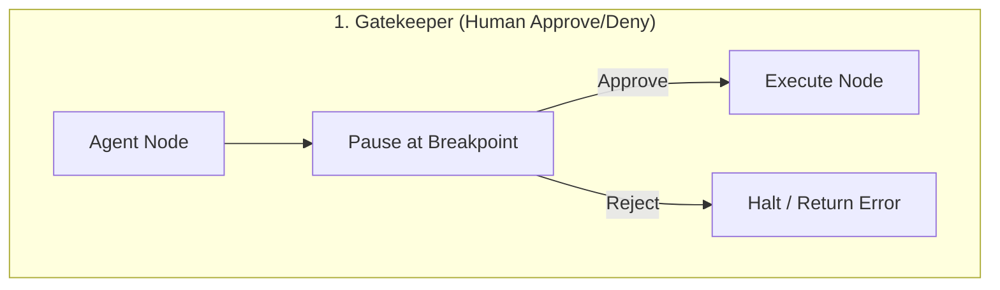
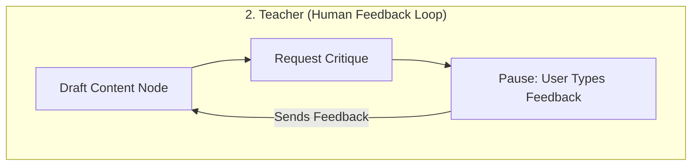
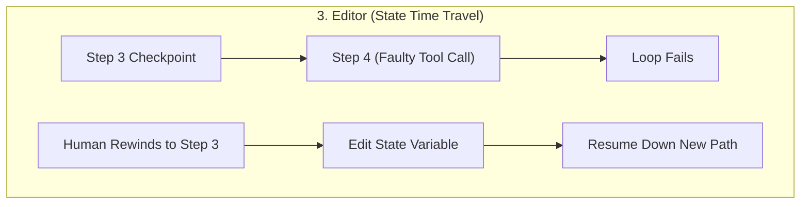

# Chapter 7: Human-in-the-Loop (HITL) 👤

In this chapter, we explore Human-in-the-Loop (HITL) patterns. We will analyze why human oversight is critical for enterprise agents, and implement patterns to pause agent execution, stream intermediate state graphs, and capture human approval or state modifications before resuming execution.

---

## 📑 Chapter Outline
- [Why Human-in-the-Loop?](#why-human-in-the-loop)
- [HITL Interaction Patterns](#hitl-interaction-patterns)
- [How State Pausing Works: Breakpoints](#how-state-pausing-works-breakpoints)
- [State Mutation: Editing & Time Travel](#state-mutation-editing--time-travel)
- [Summary & Key Takeaways](#summary--key-takeaways)


---

## 🛡️ Why Human-in-the-Loop?

While autonomous agents are powerful, they should not be given unchecked control in high-risk environments. 

Production applications require human verification for several reasons:
1. **Critical Actions**: Sending emails to clients, charging credit cards, executing code on a server, or modifying database schemas.
2. **Quality Control**: Reviewing drafted legal contracts, clinical triage decisions, or complex financial reports.
3. **Self-Correction Boundaries**: When an agent gets stuck in a tool execution loop or repeatedly fails an evaluation test, a human can step in, correct the logic, and push it forward.

---

## 🔄 HITL Interaction Patterns

There are three primary models of human interaction within agent graphs:







1. **Gatekeeper (Approve/Reject)**: The agent halts at a critical edge. The user sees the planned action and clicks "Approve" or "Reject".
2. **Teacher (Interference)**: The agent requests feedback (e.g., *"Is this summary accurate?"*). The user inputs text, which is appended to the message history, and the agent recalculates.
3. **Editor (State Mutation)**: The agent's internal state variables are displayed to the user. The user can directly change keys (e.g., changing the destination email address) before the agent executes.

---

## ⏸️ How State Pausing Works: Breakpoints

To implement HITL, stateful graphs use **Breakpoints**. You declare which nodes or edges require human input:

```
                  Node A (Agent Node)
                          │
                          ▼
            [ Interrupt / Write Checkpoint ] ──> Halt execution thread
                          │
                          ▼ (Wait for Client Event: resume/edit)
                          │
            [ Read Checkpoint & Resume ]
                          │
                          ▼
                  Node B (Tool Node)
```

1. **Interrupt Before Node**: The runner executes up to Node B. Instead of running Node B, it serializes the state to the checkpointer database and halts.
2. **Wait for Event**: The client application (React frontend, terminal prompt) reads the checkpoint database, displays the variables, and waits for a user action.
3. **Resume Execution**: When the user approves, a resume event is sent. The framework loads the state from the checkpoint and triggers Node B.

---

## ⏪ State Mutation: Editing & Time Travel

Advanced HITL patterns allow you to modify the graph's history or variables.

### 1. State Editing
If an agent is about to execute a SQL statement containing an error:
```sql
DELETE FROM users WHERE last_login > '2025-01-01';
```
The human can intercept, edit the SQL variable in the checkpoint state to:
```sql
SELECT * FROM users WHERE last_login > '2025-01-01';
```
And resume execution. The node consumes the corrected string, avoiding database corruption.

### 2. Time Travel (Rewinding)
Because checkpoints are saved sequentially in the database:
```
Checkpoint 1 (Thread 9) ──> Checkpoint 2 ──> Checkpoint 3 ──> Checkpoint 4 (Error)
                                 │
                                 ▼
                     (Fork to Checkpoint 2a) ──> Checkpoint 3a (Corrected Path)
```
If an agent goes down an incorrect reasoning path at Checkpoint 3, the developer or user can choose to rewind the thread to Checkpoint 2, alter a variable, and execute again. The runner creates a new fork, preserving the original history while directing the agent down a corrected path.

---

## 📝 Summary & Key Takeaways

- **Human-in-the-Loop** patterns provide safety, quality control, and escape hatches for autonomous systems.
- **Breakpoints** pause graphs before or after specific nodes, saving the current state to the database checkpointer.
- **State Mutation** allows users to edit variables (e.g., SQL queries, API endpoints) before the agent executes them.
- **Time Travel** leverages sequential checkpoint IDs to rewind execution history, rewrite variables, and fork down a correct path.

---

## 🏁 What's Next?
In **[Chapter 8: Persistent Memory & Context Management](../08-persistent-memory/README.md)**, we will look at how to store, query, and structure context across conversations using vector databases, entities, and GraphRAG.
