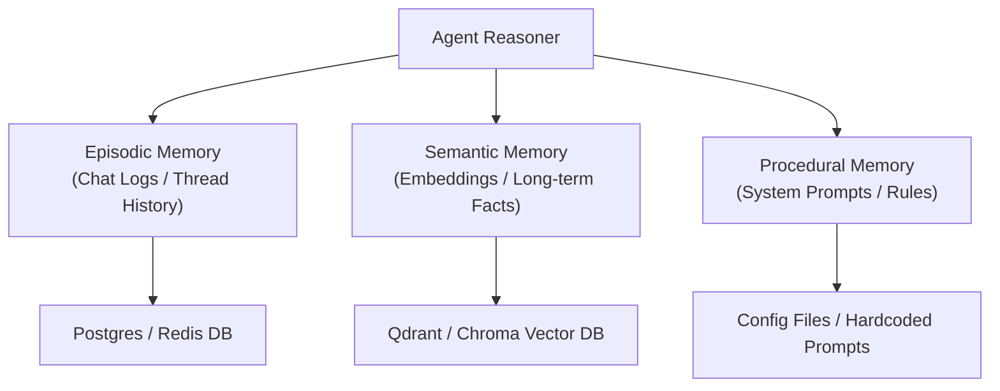
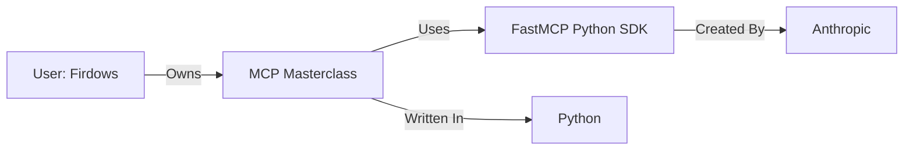

# Chapter 8: Persistent Memory & Context Management 🧠

In this chapter, we explore agent memory. We will analyze the different types of memory (Episodic, Semantic, Procedural), study context management strategies to prevent prompt bloat, and explore how GraphRAG structures entity relationships to give agents human-like associative recall.

---

## 📑 Chapter Outline
- [The Agent Memory Architecture](#the-agent-memory-architecture)
- [Episodic Memory (Conversational History)](#episodic-memory-conversational-history)
- [Semantic Memory (Long-term Facts & Entities)](#semantic-memory-long-term-facts--entities)
- [Procedural Memory (System Instructions & Rules)](#procedural-memory-system-instructions--rules)
- [GraphRAG: Associative Memory](#graphrag-associative-memory)
- [Summary & Key Takeaways](#summary--key-takeaways)

---

## 🧠 The Agent Memory Architecture

A raw LLM has no memory. If you ask it a question in a new session, it does not know who you are or what you discussed five minutes ago. To build intelligent systems, agents utilize three distinct memory layers:

---

## 💬 Episodic Memory (Conversational History)

**Episodic memory** stores the sequential list of interactions (messages) within a single conversation thread.

- **Storage**: Checkpointers write the running history of `System`, `Human`, `AI`, and `Tool` messages directly to database logs.
- **Challenge: Context Bloat**: If a thread has 100 messages, sending all of them to the LLM on every turn is slow and expensive.
- **Mitigation Patterns**:
  1. **Message Windowing**: Send only the most recent $N$ messages (e.g., last 15 messages) to the LLM.
  2. **Summarization (Buffer Memory)**: Ask a background LLM to periodically summarize old messages. Replace the old messages with a single summary block in the prompt context.

---

## 🗄️ Semantic Memory (Long-term Facts & Entities)

**Semantic memory** stores facts, preferences, and entities across conversations.

- **Example**: If a user says, *"I prefer Python over Node.js and my API key is stored in .env"*, the agent should remember this in all future threads.
- **Implementation (Write-Behind Pattern)**:
  1. During conversation, the agent runs.
  2. When the session ends, a background LLM extracts key facts (e.g., `{ "key": "language_preference", "value": "Python" }`).
  3. These facts are embedded and written into a vector database (e.g., Chroma or Qdrant).
  4. In a new session, the agent retrieves relevant facts from the vector DB based on semantic similarity to the new query and injects them into the prompt.

---

## 📜 Procedural Memory (System Instructions & Rules)

**Procedural memory** contains the static rules, schemas, guidelines, and behavioral instructions that define *how* the agent operates.

- **Structure**: Written as system instructions and tool definitions.
- **Dynamic Selection**: If an agent has 100 rules (e.g., strict legal checklists for 50 different countries), loading all of them into the system prompt is inefficient. The system queries a vector database for the country code of the client, pulls only the rules for that country, and updates the system instruction dynamically.

---

## 🕸️ GraphRAG: Associative Memory

Standard vector search retrieves isolated text fragments. It cannot perform associative recall (linking concepts). **GraphRAG** builds a knowledge graph containing **Entities** (nodes) and **Relationships** (edges).

### Why GraphRAG is superior for Agent Memory:
1. **Context Expansion**: If the agent queries *"MCP Masterclass"*, GraphRAG automatically retrieves connected concepts (*Firdows*, *FastMCP SDK*, *Python*), allowing the agent to understand the broader context.
2. **Global Summarization**: You can ask the agent *"Summarize Firdows' entire development stack"*. GraphRAG queries the relationships, compiling a complete map that vector search would miss because the facts are scattered across different document files.

---

## 📝 Summary & Key Takeaways

- **Episodic memory** tracks conversation history; manage it using message windowing or background summarization.
- **Semantic memory** extracts facts during runtime and stores them in vector databases for long-term recall.
- **Procedural memory** stores agent rules and code instructions; select relevant procedures dynamically to save tokens.
- **GraphRAG** maps entities and relations, enabling associative memory retrieval for complex questions.

---

## 🏁 What's Next?
We have completed **Level 2**! In **[Chapter 9: Agent Guardrails & Security](../09-guardrails-security/README.md)**, we cross into **Level 3** and focus on securing our agents from jailbreaks, prompt injection, and output violations.
