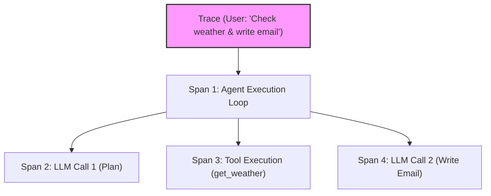
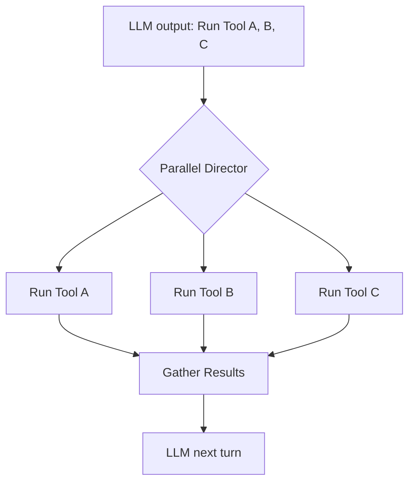

# Chapter 10: Observability & Tracing 📊

In this chapter, we explore Agent Observability. We will analyze the challenges of debugging non-deterministic agents, study open tracing standards, and trace complete execution loops in real-time to locate latency bottlenecks and cost spikes.

---

## 📑 Chapter Outline
- [The Debugging Challenge](#the-debugging-challenge)
- [Anatomy of an Agent Trace](#anatomy-of-an-agent-trace)
- [Observability Ecosystem: OpenInference, Phoenix & LangSmith](#observability-ecosystem-openinference-phoenix--langsmith)
- [Performance & Latency Optimization](#performance--latency-optimization)
- [Summary & Key Takeaways](#summary--key-takeaways)


---

## 🔍 The Debugging Challenge

Unlike traditional deterministic code, where a bug produces a predictable stack trace, agent bugs are often silent and variable:
- **Flaky Routing**: The LLM chooses the correct tool 95% of the time, but occasionally selects the wrong tool or passes invalid arguments.
- **State Mutations**: A state variable is modified across multiple nodes. Figuring out *which* node corrupted the variable is difficult without a step-by-step history.
- **Hidden Latency**: The agent takes 15 seconds to complete. Finding whether the delay is caused by slow tool API responses, LLM token generation, or network overhead requires structured tracing.

To resolve this, we cannot rely on simple print statements. We need **distributed execution tracing**.

---

## 🕸️ Anatomy of an Agent Trace

Observability frameworks model agent execution as a tree of nested **Spans** grouped under a single **Trace ID**:



- **Trace ID**: A unique identifier grouping all operations triggered by a single user request.
- **Span**: A specific segment of work (e.g., an LLM API call, a DB query, a node execution). Each span has:
  - Start and End timestamps (to calculate latency).
  - Input variables and output payloads.
  - Attributes (token counts, pricing data, model name).
  - Status (Success or Error with traceback logs).

---

## 🛠️ Observability Ecosystem

Production agents utilize standardized open-source tracing packages to collect and view telemetry:

```
[ Agent Application ] ──> Writes OpenTelemetry / OpenInference logs
                                     │
                                     ▼
                    [ Phoenix / LangSmith Dashboard ]
             (View spans, latency graphs, and token pricing)
```

1. **OpenInference**: An open metadata standard built on top of OpenTelemetry, designed to capture LLM-specific attributes like prompt template variables, token counts, and tool calls.
2. **Arize Phoenix**: An open-source local UI that runs alongside your python app, rendering beautiful execution traces, performance metrics, and cost charts.
3. **LangSmith**: A hosted developer platform providing enterprise-grade tracing, dataset collection, and playground testing.

---

## ⚡ Performance & Latency Optimization

Once tracing is active, use it to analyze and optimize your agent's performance profile:

### 1. Identify Slow Nodes
Look at the span list sorted by duration. If a database vector search tool takes 4 seconds, implement indexing or caching to drop the latency.

### 2. Prompt Caching
If your system prompt is massive, utilize models that support prompt caching (like Anthropic Claude or Gemini). Telemetry spans will show a drop in input token pricing for consecutive loop turns.

### 3. Parallel Tool Calls
Ensure your executor node can handle parallel tool execution. If the LLM generates 3 tool calls in one turn, run them concurrently using `asyncio` to reduce execution latency:



---

## 📝 Summary & Key Takeaways

- **Observability** is mandatory to debug non-deterministic routing and state mutations in agents.
- **Traces** capture the entire execution graph, nesting sub-operations like LLM calls and tool executions as **Spans**.
- Standardize telemetry using the **OpenInference** metadata specification.
- Use tools like **Arize Phoenix** or **LangSmith** to visualize traces, track cost, and locate latency bottlenecks.

---

## 🏁 What's Next?
In **[Chapter 11: Evaluation Pipelines](../11-evaluation-pipelines/README.md)**, we will build automated testing suites to run our agents against standard QA datasets, verifying accuracy and security before deployment.
