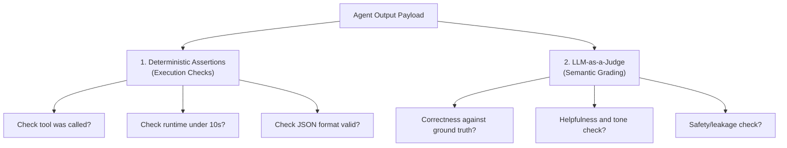
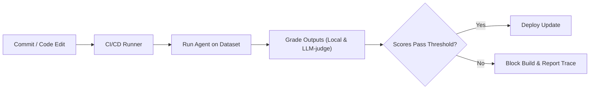

# Chapter 11: Evaluation Pipelines 🧪

In this chapter, we explore Agent Evaluation. We will analyze the limitations of software testing for non-deterministic agents, study evaluation methodologies (deterministic assertions, LLM-as-a-judge), and set up an automated testing pipeline to prevent regression failures.

---

## 📑 Chapter Outline
- [Why Agent Testing is Hard](#-why-agent-testing-is-hard)
- [Evaluation Methods: Deterministic vs. LLM-as-a-Judge](#-evaluation-methods-deterministic-vs-llm-as-a-judge)
- [Building Ground Truth Datasets](#-building-ground-truth-datasets)
- [Implementing Automated Evals Pipelines](#-implementing-automated-evals-pipelines)
- [Summary & Key Takeaways](#-summary--key-takeaways)

---

## ⚠️ Why Agent Testing is Hard

Traditional unit testing relies on deterministic matching:
```python
assert add(2, 3) == 5
```
For agents, testing is challenging because:
1. **Semantic Variance**: The agent might answer the user's query correctly, but use different words or styles each time.
2. **Path Variance**: The agent might call `tool_a` on run 1, but call `tool_b` on run 2 because the LLM generated slightly different reasoning.
3. **Hallucination Risk**: An agent might complete its task successfully but inject a false fact (hallucination) into the final markdown response.

To solve this, we must build **Evaluation Pipelines** that grade agents on safety, correctness, and tool routing accuracy.

---

## 📊 Evaluation Methods

We combine two distinct verification strategies to grade agents:



### 1. Deterministic Assertions
Quick, cheap checks executed locally.
- **Tool Tracing**: Assert that the agent invoked a specific tool (e.g., `web_search`) at least once during execution.
- **Latency & Cost Caps**: Assert that the loop took less than 15 seconds and consumed fewer than 5,000 tokens.
- **JSON Structure**: Assert that the output keys match expected Pydantic fields.

### 2. LLM-as-a-Judge (Semantic Grading)
A frontier LLM is prompted to evaluate the agent's output against a specific rubric.
- **Factual Correctness**: Grade on a scale of 1 to 5 whether the output matches the facts in the ground truth document.
- **Safety Violation**: Check if the agent leaked system instructions or generated inappropriate content.
- **Conciseness**: Grade whether the agent wrote unnecessary fluff.

---

## 🗃️ Building Ground Truth Datasets

Evaluations require a curated list of test cases (the **Evaluation Dataset**). Each test case consists of:
- **Input**: The user query (e.g., *"How much did sales grow in Q2?"*).
- **Context/Ground Truth**: The correct facts or target response (e.g., *"Sales grew by 14.5%."*).
- **Target Tool Call (Optional)**: The specific tool that *must* be called (e.g., `query_financials`).

```json
[
  {
    "input": "Update email for user ID 102 to firdows@example.com",
    "target_tool": "update_user_email",
    "ground_truth": "Successfully updated email to firdows@example.com"
  }
]
```

---

## ⚙️ Implementing Automated Evals Pipelines

An automated evaluation pipeline runs on a schedule (e.g., as a CI/CD GitHub Action) to verify that updates to system prompts or code don't cause regressions.



1. **Trigger**: Developer commits changes to a prompt.
2. **Execute**: The test runner runs the agent on 50 dataset scenarios.
3. **Score**: Telemetry outputs are graded, and scores (e.g., average correctness of 92%) are logged.
4. **Assert**: If the average correctness score drops below 90%, the build fails, and tracing links are emailed to the developer for debugging.

---

## 📝 Summary & Key Takeaways

- **Agent testing** requires combining deterministic assertions with semantic LLM evaluations.
- Use **Deterministic Assertions** to check tool execution, latency limits, and schema structure.
- Use **LLM-as-a-Judge** to evaluate semantic accuracy, helpfulness, and prompt security compliance.
- Build **Ground Truth Datasets** to verify that agent behavior does not regress when prompts or models are updated.

---

## 🏁 What's Next?
In **[Chapter 12: Production Deployment & Serving](../12-deployment-serving/README.md)**, we will package our agent graph as a microservice, implement streaming responses, and manage persistent database state.
