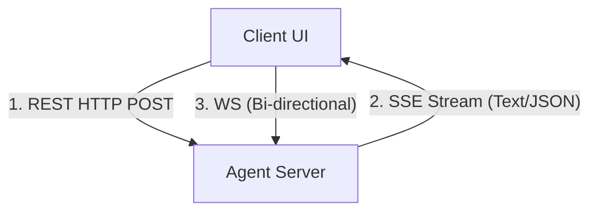
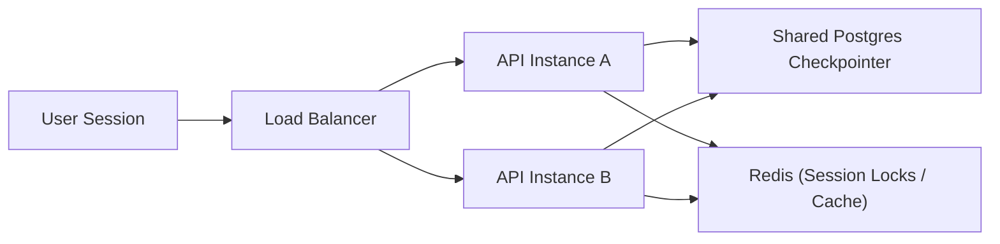
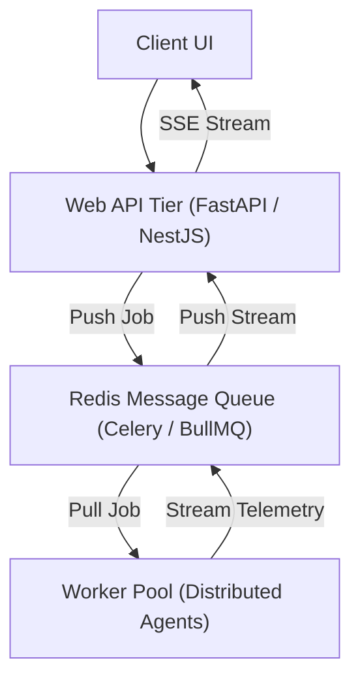

# Chapter 12: Production Deployment & Serving 🚀

In this chapter, we explore Agent Deployment. We will analyze the server architectures required to serve agents, implement real-time output streaming (Server-Sent Events), and design scaling strategies to handle thousands of concurrent stateful sessions.

---

## 📑 Chapter Outline
- [Serving Architecture: REST vs. Streaming vs. WebSockets](#serving-architecture-rest-vs-streaming-vs-websockets)
- [Implementing Server-Sent Events (SSE) Streaming](#implementing-server-sent-events-sse-streaming)
- [Managing Persistent Sessions in Production](#managing-persistent-sessions-in-production)
- [Scaling Stateful Agent Workloads](#scaling-stateful-agent-workloads)
- [Summary & Key Takeaways](#summary--key-takeaways)


---

## 🌐 Serving Architecture

Serving agents is fundamentally different from serving standard web APIs:
- **High Latency**: An agent processing a query might take 10 seconds to generate its plan and execute tools. If we use a standard REST request-response loop, the user faces a blank loading screen, leading to a poor user experience.
- **Incremental States**: The user wants to see what the agent is doing in real-time (*"Thinking..."*, *"Calling weather tool..."*, *"Scraping website..."*).

To solve this, we choose the right connection protocol:



1. **REST HTTP POST**: Used only to *initialize* or trigger a new execution thread.
2. **Server-Sent Events (SSE)**: The standard for agent streaming. It is unidirectional (Server $\rightarrow$ Client), easy to implement over standard HTTP, and natively supports streaming tokens and tool status JSON payloads.
3. **WebSockets (WS)**: Used when bi-directional, real-time interaction is required (e.g., streaming voice agents or highly interactive drawing boards).

---

## 🌊 Implementing Server-Sent Events (SSE) Streaming

An agent SSE stream splits the output into structured events so the frontend can render thoughts, tool calls, and final tokens separately.

### Example Stream Payload Format:
```text
event: node_start
data: {"node": "planner", "status": "planning"}

event: token
data: {"text": "I"}

event: token
data: {"text": " will"}

event: tool_call
data: {"tool": "web_search", "args": {"query": "FastMCP"}}

event: tool_output
data: {"result": "FastMCP is a python SDK for MCP..."}

event: token
data: {"text": " FastMCP is a SDK..."}

event: end
data: {"status": "complete"}
```

This event stream keeps the user engaged by showing exactly what the agent is doing block-by-block.

---

## 🗄️ Managing Persistent Sessions in Production

In development, we use local checkpointers (like SQLite). In production, we deploy a distributed database setup:



1. **Shared Database Checkpointer**: Use PostgreSQL with a JSONB column to store state checkpoints. This ensures that any API instance can load the agent's history when a user sends a follow-up query.
2. **Session Locking**: Since agent loops run asynchronously, if a user double-clicks "Submit", they could trigger two concurrent loops on the same thread, causing state corruption. We use **Redis** to acquire a distributed session lock on `thread_id` while the agent is running.

---

## 📈 Scaling Stateful Agent Workloads

Because agent runs are long-lived and CPU/network-intensive, running them inside the web server process will block API event loops.

For enterprise scale, we decouple the web tier from the execution tier:



- **Web API Tier**: A lightweight container that receives requests, creates thread records, pushes jobs to the queue, and streams events back to the client.
- **Message Queue**: Stores running job payloads.
- **Worker Pool**: Scalable worker containers (running Celery, BullMQ, or Ray) that pull jobs, execute the agent graphs, and stream intermediate telemetry back through Redis.

---

## 📝 Summary & Key Takeaways

- Deploy agents using **Server-Sent Events (SSE)** to stream intermediate thoughts and tool status updates to the user.
- Persist state across API containers using a shared **PostgreSQL checkpointer**.
- Prevent concurrent execution bugs by implementing distributed **session locking with Redis**.
- Scale operations by decoupling the web API tier from background execution threads using **Message Queues (Celery)**.

---

## 🏁 What's Next?
In **[Chapter 13: Context Caching & KV-Cache Optimization](../13-context-caching/README.md)**, we will explore the deep mechanics of KV attention states, prefix matching rules, and the economics of caching static contexts in production.

