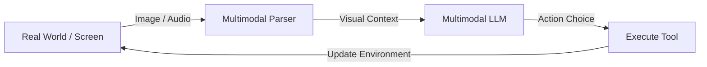
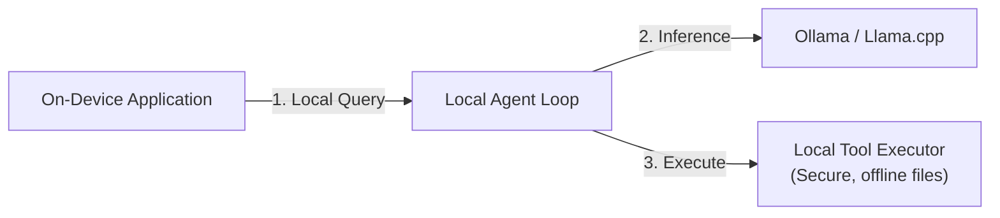
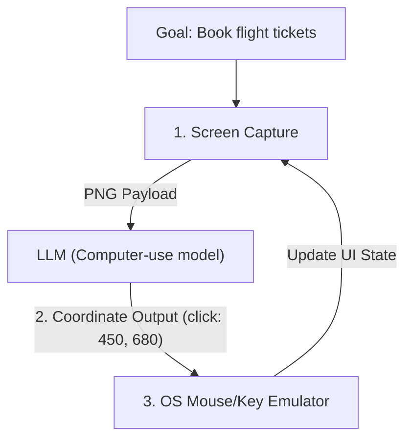

# Chapter 14: The Future of Agents 🚀

In this final chapter, we explore the cutting-edge horizon of agentic systems. We will analyze Multimodal Agent loops, study how to run lightweight agents locally on-device, and examine the mechanics of web-navigating ("computer use") agents that control browsers and desktop environments directly.

---

## 📑 Chapter Outline
- [Multimodal Agent Loops (Vision & Voice)](#-multimodal-agent-loops-vision--voice)
- [Local Agents & Small Language Models (SLMs)](#-local-agents--small-language-models-slms)
- [Web-Navigating & Computer-Use Agents](#-web-navigating--computer-use-agents)
- [The Grand Masterclass Wrap-Up](#-the-grand-masterclass-wrap-up)

---

## 👁️ Multimodal Agent Loops (Vision & Voice)

Early agents were text-only. The next generation of agents integrates Vision and Voice models directly into the planning loop.

### 1. Vision-Guided Agents
Instead of parsing messy HTML, vision-guided agents capture screenshots of a webpage or app UI, parse layout boundaries, and click directly on coordinates. This solves issues with dynamic web layouts and shadow DOMs.

### 2. Real-Time Audio Loops
With models supporting low-latency audio input/output, agents process spoken commands and generate natural verbal reasoning streams, bypassing text-to-speech (TTS) latency bottlenecks.

---

## 💻 Local Agents & Small Language Models (SLMs)

Sending every agent turn to a cloud LLM is expensive and raises data privacy concerns. Running agents locally on-device is becoming practical thanks to Small Language Models (SLMs) like Llama-3-8B, Phi-3, or Gemma-2-9B.

- **Local Execution Engine**: Using engines like **Ollama** or **Llama.cpp** to run quantization formats (GGUF) locally.
- **Privacy & Security**: Local agents can interact directly with local files, proprietary source code, and private databases without data leaving the user's secure network.
- **Offline Capability**: Agents can continue to operate and automate tasks in remote settings without internet connectivity.

---

## 🌐 Web-Navigating & Computer-Use Agents

The ultimate form of autonomy is an agent that can interact with any software just like a human: using a mouse, keyboard, and browser.

### 1. Claude Computer Use & OSWorld
Frontier models can output screen interaction commands:
- `mouse_move(x, y)`
- `click(x, y)`
- `type(text)`
The agent runtime captures screenshots, calculates the bounding box of input elements, and executes actions via standard OS keyboard/mouse automation libraries.

### 2. Browser Grounding (Playwright/Puppeteer)
Web agents run headless browsers, interacting directly with web pages. They scrape prices, bypass login flows, fill checkout forms, and solve CAPTCHAs, acting as automated digital assistants.

---

## 🏢 The 2026 Big Tech Landscape: GCP, Anthropic, OpenAI, Meta, & AWS

By mid-2026, the tech giants are competing directly to build the orchestration layers and hosting infrastructures for autonomous systems:

| Company | Flagship Agent Capabilities & Tools | Core Focus |
| :--- | :--- | :--- |
| **Google Cloud (GCP)** | **Gemini Enterprise Agent Platform**, Gemini 3.5 Flash agents, and persistent conversational search. | Proactive daily workflow automation and enterprise search agents. |
| **Anthropic** | **Claude Managed Agents**, Karpathy-led pretraining research for AI-driven development. | Enterprise autonomous work hubs and coding agents. |
| **OpenAI** | **GPT-5.5** (native agent-first execution), OpenAI Deployment Company. | Low-latency, multi-step planning loops and reasoning pipelines. |
| **Meta** | **Muse Spark** (70B MoE model utilizing 16 parallel agents/experts). | Open-weights agentic expert systems and high-throughput deployments. |
| **AWS** | **Amazon Bedrock Managed Agents** (multi-model server orchestrations). | Multi-cloud enterprise tool integration and zero-trust security hosting. |

---

## 🎓 The Grand Masterclass Wrap-Up

Congratulations! You have completed the curriculum chapters of the **Agentic Workflows & Multi-Agent Orchestration Masterclass**. 

Throughout this course, you have moved from:
1. **Foundations**: Structuring reasoning loops (ReAct) and overcoming LLM/RAG limits.
2. **Orchestration**: Graph theory (LangGraph), multi-agent supervisor/peer designs, checkpoints, and human interventions.
3. **AgentOps & Optimization**: Setting up telemetry traces, automated evaluations, scaling production deployments (Celery/Postgres), and optimizing inference using KV-caching and Context Caching.

You now possess the complete theoretical toolkit required to build, test, and run enterprise-grade, autonomous AI systems.

---

## 🏁 Final Step
Now that you have mastered the architectural theory, it's time to build! Go to **[Lab 1: The Vanilla ReAct Loop](../../labs/lab-01-vanilla-react/README.md)** to implement your first autonomous planning loop from scratch in pure Python.
