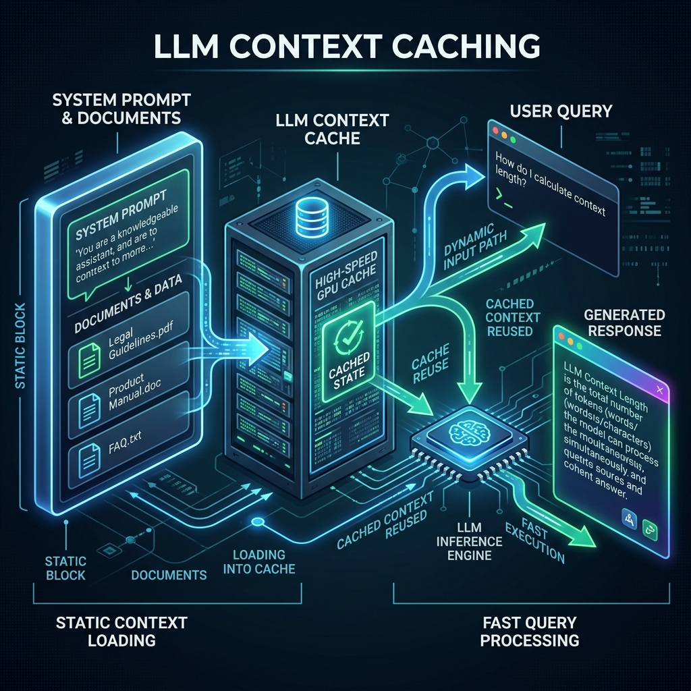
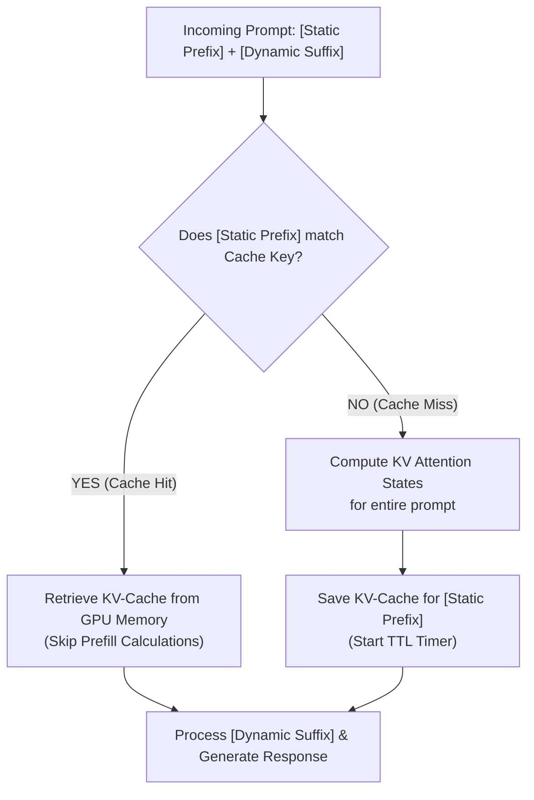

# Chapter 14: Context Caching & KV-Cache Optimization ⚡

In stateful multi-agent workflows, the same system instructions, database schemas, API tools, and long chat histories are sent repeatedly to the LLM. In production, this causes high **Time-to-First-Token (TTFT)** latency and **runaway API token costs**. 

This chapter covers the deep technical mechanics of **KV-Caching** and **Context Caching**, explaining how they optimize the transformer prefill phase, how they are implemented in code, and their economics in production agentic systems.

---

## Outline
*   [The Math: What is the KV-Cache?](#-the-math-what-is-the-kv-cache)
*   [Context Caching vs. Standard KV-Caching](#-context-caching-vs-standard-kv-caching)
*   [Prefix Matching & Eviction Rules](#-prefix-matching--eviction-rules)
*   [Code Implementation (Python)](#-code-implementation-python)
*   [Token Economics & Latency Analysis](#-token-economics--latency-analysis)
*   [Summary & Key Takeaways](#-summary--key-takeaways)

---

## 🎨 Architectural Overview

Below is the conceptual architecture of how context caching stores pre-computed states to optimize inference:



---

## 🧠 The Math: What is the KV-Cache?

To understand context caching, we must first understand the mathematics of the **Transformer Self-Attention** mechanism.

For a sequence of input tokens, the model projects them into three matrices: **Queries ($Q$)**, **Keys ($K$)**, and **Values ($V$)**. The attention score is calculated as:

$$\text{Attention}(Q, K, V) = \text{softmax}\left(\frac{QK^T}{\sqrt{d_k}}\right)V$$

### The Prefill Bottleneck
1.  **Token Processing**: When you send a prompt of length $N$, the model must process all $N$ tokens at once to compute their initial $Q, K, V$ states. This is the **Prefill Phase**.
2.  **Quadratic Complexity**: Computing the attention matrix ($QK^T$) requires comparing every token to every other token. This has a quadratic time complexity of $\mathcal{O}(N^2)$.
3.  **The Problem**: If you send a 100k-token prompt (e.g., a codebase or business guidelines document) on every turn of a conversation, the model re-computes these attention matrices from scratch, creating a massive processing delay (high TTFT).

### The Solution: KV-Caching
Instead of re-computing $K$ and $V$ for previous tokens at every step, the model server stores the computed $K$ and $V$ matrices in GPU/TPU memory. During generation, the model only computes the $Q$ matrix for the *new* token and multiplies it by the cached $K$ and $V$ matrices. This reduces the step complexity for generating new tokens to $\mathcal{O}(N)$.

---

## 🆚 Context Caching vs. Standard KV-Caching

It is crucial to distinguish between these two caching mechanisms:

| Dimension | Standard KV-Caching (Intra-Request) | Context Caching (Inter-Request) |
| :--- | :--- | :--- |
| **Scope** | Runs during a **single** generation call. | Persists **across separate** API calls. |
| **Lifetime** | Deleted as soon as the API response completes. | Persists in memory for minutes or hours (TTL). |
| **Control** | Handled automatically by the model runner/engine. | Controlled explicitly by the developer via API. |
| **Billing Impact** | None (you are billed standard rates for all tokens). | Massive (cached tokens are billed at a 50-90% discount). |

---

## 📏 Prefix Matching & Eviction Rules

To trigger a context cache hit, the model server uses **Strict Prefix Matching**:



### The Caching Constraints:
1.  **Token Zero Alignment**: The static cached data must start at token index `0`. You cannot cache a block that appears in the middle or end of the prompt.
2.  **Minimum Token Limits**: Because creating and loading caches has overhead, providers enforce minimum size limits. Google Gemini requires a minimum of **~32,768 tokens** before a cache can be created. Anthropic Claude requires **1,000 tokens**.
3.  **TTL (Time-To-Live)**: Caches are assigned a TTL (typically 30 minutes to a few hours). Every time a request hits the cache, the TTL timer is reset. If no requests hit it within the TTL window, it is evicted.

### 💡 Prefix Matching in Action: A Chat Session Example

Here is a visual walk-through of how the cache boundary behaves during a multi-turn conversation. 

Assume we have cached:
`[System Instructions (5k tokens)]` + `[Reference PDF Guidelines (45k tokens)]` = **Cached Prefix (50k tokens)**

*   **Turn 1**: 
    *   *Prompt Sent*: `[Cached Prefix (50k tokens)]` + `[User: Hello! (3 tokens)]`
    *   *Result*: **CACHE HIT**. Only the new `Hello!` query (3 tokens) is processed by the model engine. 
*   **Turn 2**: 
    *   *Prompt Sent*: `[Cached Prefix (50k tokens)]` + `[User: Hello! (3 tokens)] + [AI: Hi! (2 tokens)] + [User: Check policy X (10 tokens)]`
    *   *Result*: **CACHE HIT**. The 50k token prefix still matches exactly at index 0. Only the trailing 15 conversational tokens are computed.

---

## 💻 Code Implementation (Python)

Let's break down the implementation using the official Google **`google-genai`** SDK into three small, simple steps:

### Step 1: Define Your Static Context
Create a single unified string containing all the static prompts and reference files you want to cache.

```python
import os
from google import genai
from google.genai import types

client = genai.Client()

# Static context (Must exceed 32,768 tokens for Gemini)
system_instruction = "You are a customer support agent."
large_documents = [
    "Context doc 1: [Lengthy product manual text...]",
    "Context doc 2: [Lengthy API reference specifications...]"
]
combined_context = system_instruction + "\n" + "\n".join(large_documents)
```

### Step 2: Create the Cache on the Server
Register the static context with the Gemini API cache manager. This computes the KV attention states once and returns a reference name.

```python
print("🔌 Loading static context into Google cache database...")
cache = client.caches.create(
    model="gemini-2.5-flash",
    config=types.CreateCachedContentConfig(
        contents=[combined_context],
        displayName="api_docs_cache",
        ttl="300s", # Evict from memory if unused for 5 minutes (300 seconds)
    )
)
print(f"🟢 Cache Ready! Cache ID Name: {cache.name}")
```

### Step 3: Generate Responses Using the Cache Reference
Query the model by pointing to the unique cache ID. The API will fetch the pre-computed KV states, skipping the prefill phase.

```python
response = client.models.generate_content(
    model="gemini-2.5-flash",
    contents="How do I configure the API timeout parameter?",
    config=types.GenerateContentConfig(
        # Pass the unique cache ID name
        cached_content=cache.name,
    )
)
print(f"🤖 Response: {response.text}")

# 4. Clean up the cache manually when finished
client.caches.delete(name=cache.name)
print("🗑️ Cache deleted successfully.")
```

---

## 📊 Token Economics & Latency Analysis

Context caching changes the economics of running LLM agents:

### 1. Cost Savings
By reusing pre-computed states, providers offer heavy discounts:
*   **Google Gemini**: Offers a **75% discount** on cached input tokens compared to standard input tokens.
*   **Anthropic Claude**: Offers a **75% discount** on cached tokens and a **25% surcharge** on the initial cache creation write.
*   **OpenAI**: Offers a **50% discount** on cached input tokens.

### 2. Latency Optimization
Bypassing prefill math drops the **Time-To-First-Token (TTFT)**. For a 100k-token prompt:
*   *Without Caching*: Prefill can take **4.5 to 7.0 seconds** of compute time before the first character is generated.
*   *With Caching*: Prefill drops to **0.2 to 0.4 seconds**, a **~95% latency reduction**.

---

## 📝 Summary & Key Takeaways

*   **KV-Caching** stores Key and Value attention matrices to optimize generation from $\mathcal{O}(N^2)$ to $\mathcal{O}(N)$ complexity.
*   **Context Caching** persists these matrices *across separate requests*, saving them in GPU memory for multi-agent loops.
*   **Prefix Matching** is strict; cached content must start at token `0` and be character-identical.
*   **Production agents** must group static resources at the top of the prompt to maximize cache hits.

---

## 🏁 What's Next?
In **[Chapter 14: The Future of Agents](../13-future-of-agents/README.md)**, we will explore multimodality, local runtimes, and the evolution of web-navigating agents.
