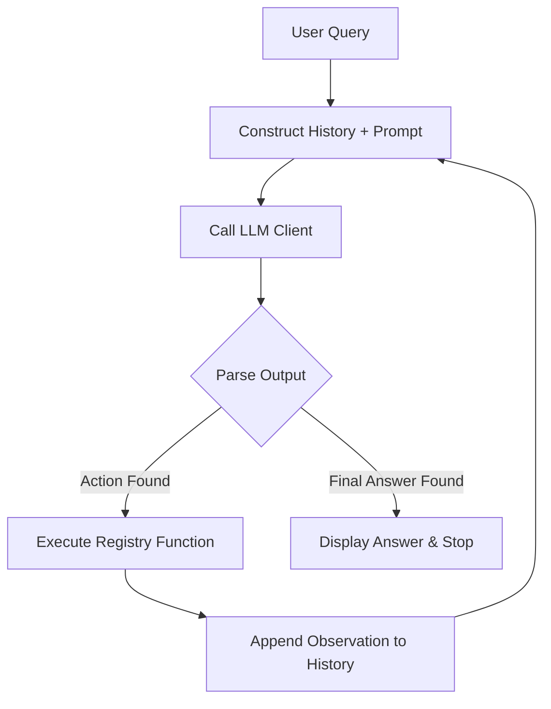

# Lab 1: The Vanilla ReAct Loop 🧪

Welcome to Lab 1! In this lab, we build a fully functioning **ReAct (Reason + Action)** agent from scratch in pure Python without using any orchestrating frameworks like LangChain or LangGraph. 

---

## 🎯 Learning Objectives
- Learn how LLMs parse and execute actions via structured prompts.
- Understand the mechanics of the agent execution loop: `Thought -> Action -> Observation -> Repeat`.
- Implement a local Tool Registry.
- Design fallback strategies and parsing engines to handle model outputs.

---

## 📂 Code Files
- [**agent.py**](agent.py) — The core Python script containing the tool registry, ReAct loop, and execution logic.

---

## ⚙️ How it Works

### 1. The Prompt Contract
We feed the LLM a strict system prompt (`SYSTEM_PROMPT`) defining the available tools (`get_weather`, `calculate_tax`) and instruct it to format its output using XML-style or plain text prefixes:
- `Thought:` for planning logic.
- `Action:` to invoke a tool, structured as `tool_name(args)`.
- `Final Answer:` to present the result and terminate the loop.

### 2. The Loop
The python script invokes the LLM, reads the response, parses the `Action:` line using a Regular Expression, calls the local function, appends the output as `Observation: ...`, and loops:



---

## 🚀 Running the Lab

### Prerequisites
Make sure you have installed requirements and have your terminal in this directory:
```bash
cd labs/lab-01-vanilla-react
```

### Option A: Local Demonstration Mode (No API Key)
If you don't have a Gemini API key set, the code automatically runs in **Mock Mode** using a local simulator script. This allows you to inspect the step-by-step turns of the ReAct execution loop without spending tokens:
```bash
python agent.py
```

### Option B: Live Agent Mode (With Gemini API Key)
To run the agent against live Gemini models, set your API key environment variable and run:
```bash
export GEMINI_API_KEY="your-gemini-api-key"
python agent.py
```

You can also pass a custom query as command-line arguments:
```bash
python agent.py "What is the weather in London right now?"
```
