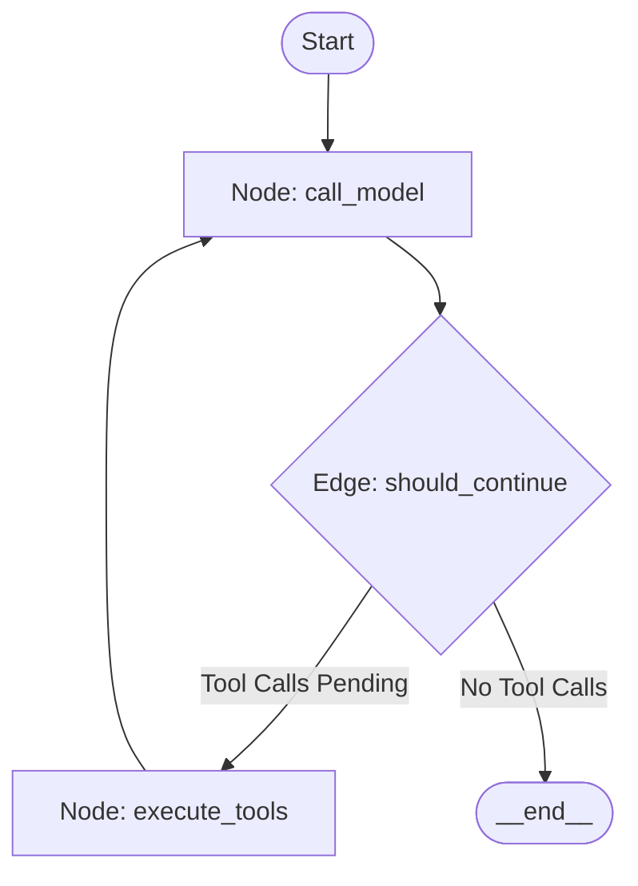

# Lab 2: Stateful LangGraph 🔁

Welcome to Lab 2! In this lab, we build a **Stateful Agent Workflow** illustrating the core mechanics of `LangGraph`. You will learn how to define shared states, execute code inside graph nodes, and write conditional edges to route execution.

---

## 🎯 Learning Objectives
- Learn how to define a shared, typing-safe **AgentState**.
- Implement **Nodes** representing discrete tasks (Reasoning, Tool Execution).
- Write **Conditional Edges** to dynamically route the execution flow.
- Understand how **Reducers** append state logs across the cyclic graph.

---

## 📂 Code Files
- [**agent.py**](agent.py) — The Python script demonstrating the LangGraph loop, nodes, and conditional edges.

---

## ⚙️ How it Works

### 1. The State Schema
In stateful graph environments, all variables are stored in a central `AgentState` object. Nodes return specific updates that are merged back into the state using reducers (like appending a new message to the message history list).

### 2. Nodes and Routing
The agent uses a state machine to cycle through nodes:



- **`call_model` Node**: Uses the LLM to inspect the conversation state and output a response containing text or a list of tool call instructions.
- **`should_continue` Edge**: Reads the latest state message. If a tool call is pending, it routes to the execute node; otherwise, it stops the graph.
- **`execute_tools` Node**: Invokes the corresponding Python tool function and appends the result to the state.

---

## 🚀 Running the Lab

### Run instructions
Navigate to the lab directory:
```bash
cd labs/lab-02-stateful-langgraph
```

Run the agent script:
```bash
python agent.py
```

### Modes of Operation
- **Default Mode**: If `GEMINI_API_KEY` is not present, the script executes using a simulated state node trace. This shows the flow step-by-step.
- **Live Mode**: Set your API key in the environment to connect it directly to Google Gemini models:
  ```bash
  export GEMINI_API_KEY="your-gemini-api-key"
  python agent.py
  ```
