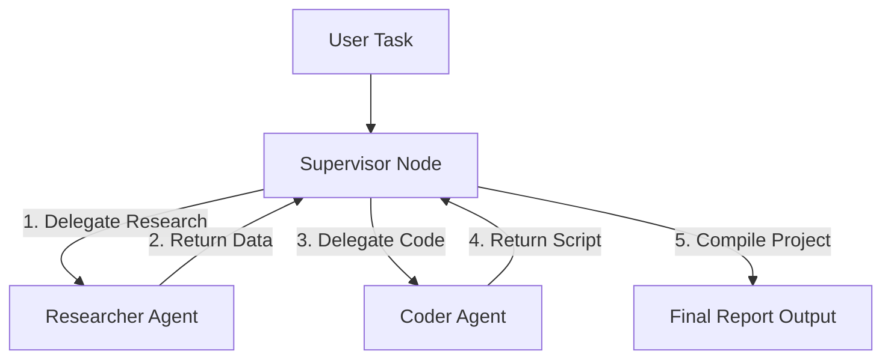

# Lab 3: The Supervisor Team 👥

Welcome to Lab 3! In this lab, we implement an **Orchestrator-Worker (Supervisor)** pattern. You will see how a central supervisor agent delegates sub-tasks to specialized domain agents (Researcher, Coder) to divide complexity and prevent context window overload.

---

## 🎯 Learning Objectives
- Architect a multi-agent system using a central supervisor router.
- Define communication boundaries and state handoffs between agents.
- See how specialized worker agents restrict tool scopes to maximize accuracy.

---

## 📂 Code Files
- [**agent.py**](agent.py) — The Python script implementing the supervisor state machine, researcher agent, and coder agent.

---

## ⚙️ How it Works

### 1. Separation of Concerns
Instead of one agent attempting to search the web *and* write code simultaneously, we divide labor:
- **Supervisor**: Holds the high-level task goal, routes tasks to workers, and compiles the final report.
- **Researcher Agent**: Specialized in gathering facts and documentation.
- **Coder Agent**: Specialized in consuming structured facts to output clean implementation code.

### 2. Multi-Agent Topology


---

## 🚀 Running the Lab

### Run instructions
Navigate to the lab directory:
```bash
cd labs/lab-03-supervisor-team
```

Run the agent script:
```bash
python agent.py
```

### Modes of Operation
- **Default Mode**: If `GEMINI_API_KEY` is not present, the script executes using a rule-based mock router. This demonstrates the delegation sequence.
- **Live Mode**: Set your API key in the environment to connect it directly to Google Gemini models to drive the supervisor logic:
  ```bash
  export GEMINI_API_KEY="your-gemini-api-key"
  python agent.py
  ```
