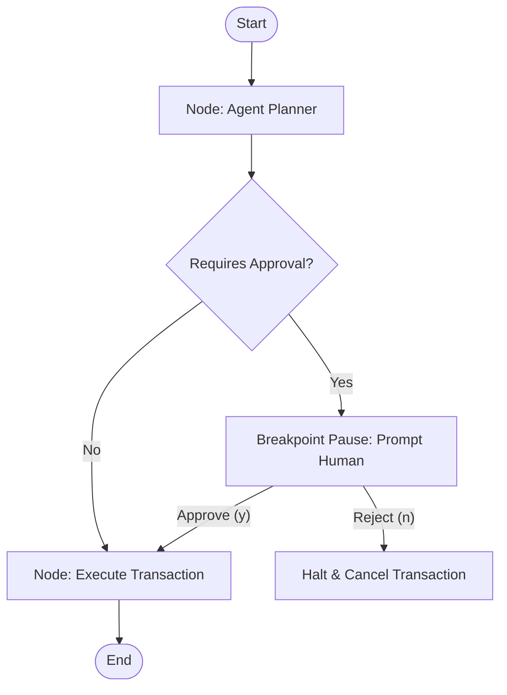

# Lab 4: Human Interruption (HITL) 👤

Welcome to Lab 4! In this lab, we implement a **Human-in-the-Loop (HITL) Breakpoint** safeguard. You will learn how to intercept agent actions, pause the execution thread, prompt an administrator for validation, and modify or abort execution based on user feedback.

---

## 🎯 Learning Objectives
- Design a validation breakpoint checking agent outputs before running destructive nodes.
- Capture human console inputs (`Approve / Reject`) during state suspension.
- See how state persistence allows resuming or terminating threads cleanly.

---

## 📂 Code Files
- [**agent.py**](agent.py) — The Python script illustrating the transaction generation node, the breakpoint prompt, and the database node execution.

---

## ⚙️ How it Works

### 1. The Breakpoint Checkpoint
When an agent prepares a database mutation query (e.g., `UPDATE accounts`), we don't route immediately to the execution engine. Instead, the runner halts the current run and updates status to `pending_approval`.

### 2. Safeguard Loop


- **Interactive Shell prompt**: The script halts and prints the target transaction parameters, prompting: `Approve execution? (y/n)`.
- **Handoff**: If approved, execution resumes and commits the database transaction. If rejected, it aborts.

---

## 🚀 Running the Lab

### Run instructions
Navigate to the lab directory:
```bash
cd labs/lab-04-human-interruption
```

Run the agent script:
```bash
python agent.py
```

Try passing custom recipients and transaction amounts via parameters:
```bash
python agent.py "Alice" 1250.00
```
Then type `y` to approve or `n` to reject in your console.
