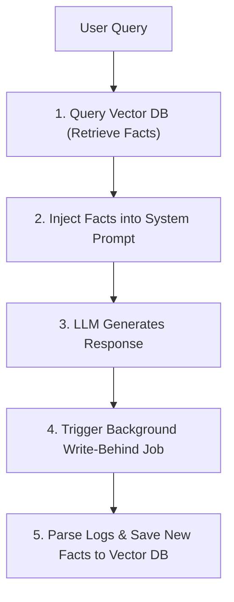

# Lab 5: Dual-Core Memory Engine 🧠

Welcome to Lab 5! In this lab, we build a **Dual-Core Memory Engine** combining Episodic (conversational thread logs) and Semantic (long-term facts stored in vector database keys) memories. You will learn how memory is queried at session start, and how new memories are extracted and saved using a write-behind pipeline.

---

## 🎯 Learning Objectives
- Architect the division of labor between Episodic and Semantic memory systems.
- Query a vector-based database layer to inject context before generating LLM prompts.
- Implement a **Write-Behind** pipeline to analyze conversation logs and extract persistent user facts.

---

## 📂 Code Files
- [**agent.py**](agent.py) — The Python script containing the episodic mock database, semantic database simulation, retrieval nodes, and write-behind extractor.

---

## ⚙️ How it Works

### 1. Dual-Core Memory Workflow


### 2. Retrieval & Extraction
- **Retrieve Node**: Triggered before calling the model. It performs a keyword match against semantic database keys and injects matching facts (e.g., location or language preferences) into the prompt context.
- **Write-Behind Node**: Triggered asynchronously after the conversation turn. It reads the raw message logs, identifies new preferences (e.g., device or protocols discussed), and writes them to the persistent database.

---

## 🚀 Running the Lab

### Run instructions
Navigate to the lab directory:
```bash
cd labs/lab-05-memory-engine
```

Run the agent script:
```bash
python agent.py
```

### Modes of Operation
- **Default Mode**: If `GEMINI_API_KEY` is not present, the script executes using local simulated memory traces. This demonstrates the flow step-by-step.
- **Live Mode**: Set your API key in the environment to connect it directly to Google Gemini models to drive the agent reasoning:
  ```bash
  export GEMINI_API_KEY="your-gemini-api-key"
  python agent.py
  ```
