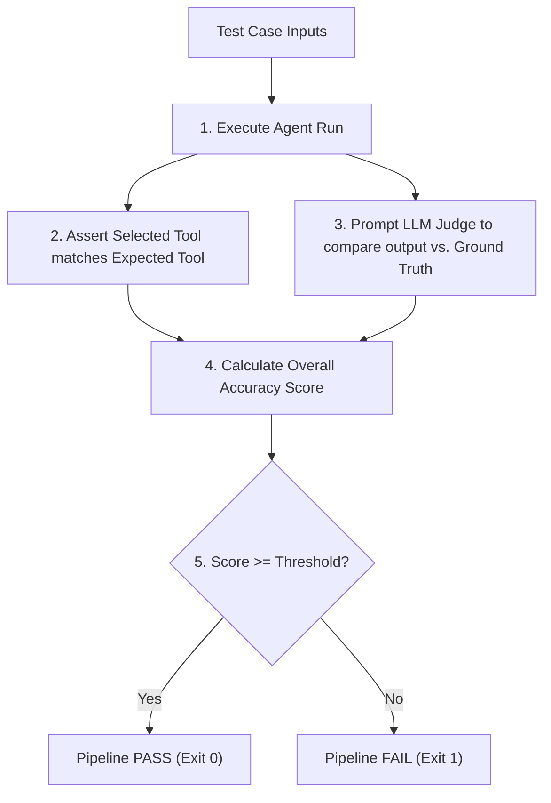

# Lab 6: Evaluation Pipelines 🧪

Welcome to Lab 6! In this lab, we build an automated **Agent Evaluation Pipeline** that grades agent correctness and tool selection against a Ground Truth dataset. You will learn how to combine deterministic assertions with semantic grading driven by an LLM-as-a-Judge.

---

## 🎯 Learning Objectives
- Design and compile a Ground Truth dataset of test scenarios.
- Run deterministic assertions to verify correct tool routing.
- Integrate an **LLM-as-a-Judge** scoring engine to grade semantic content correctness.
- Establish baseline thresholds to pass or fail build pipelines in CI/CD environments.

---

## 📂 Code Files
- [**agent.py**](agent.py) — The Python script implementing the test datasets, simulated agent runs, LLM judge connector, and scoring reports.

---

## ⚙️ How it Works

### 1. Verification Flow


### 2. Evaluator Nodes
- **Tool Selector Check (Deterministic)**: Verifies if the correct function registry API was called.
- **Semantic Correctness Judge**: Invokes a secondary frontier LLM with a scoring rubric, analyzing whether the semantic content matches the expected target.

---

## 🚀 Running the Lab

### Run instructions
Navigate to the lab directory:
```bash
cd labs/lab-06-evals-pipeline
```

Run the agent script:
```bash
python agent.py
```

### Modes of Operation
- **Default Mode**: If `GEMINI_API_KEY` is not present, the script executes using local text-parsing matchers. This demonstrates the pipeline pass/fail reporting.
- **Live Mode**: Set your API key in the environment to connect it directly to Google Gemini models to drive the LLM-as-a-Judge logic:
  ```bash
  export GEMINI_API_KEY="your-gemini-api-key"
  python agent.py
  ```
