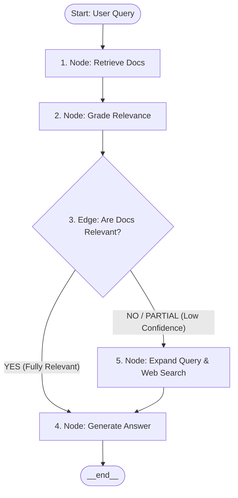

# Lab 7: Corrective RAG (CRAG) Engine 🔍

Welcome to Lab 7! In this lab, we build a **Corrective RAG (CRAG)** agent workflow. You will learn how to move beyond static, passive retrieval by adding evaluation, query reformulation, and fallback tools to make RAG systems resilient and self-correcting.

---

## 🎯 Learning Objectives
- Define a stateful **RAG State** that tracks search history, query variants, and retrieved document grades.
- Implement an **In-Memory Vector Store** calculating cosine similarity using real LLM embeddings.
- Build a **Document Grader** node that evaluates document relevance to prevent hallucinations.
- Implement a **Query Reformulator** node to expand search terms when local database lookups fail.
- Route execution dynamically in LangGraph using conditional edges based on content confidence.

---

## ⚙️ How it Works

### 1. The Corrective RAG Workflow
Unlike standard RAG, which directly feeds retrieved documents into the LLM, CRAG adds a verification step to grade retrieved documents:



- **`retrieve` Node**: Queries the vector store using current search terms.
- **`grade_documents` Node**: Asks the LLM to inspect each retrieved document. Chunks are graded as `relevant` or `irrelevant`.
- **`check_relevance` Edge**: Evaluates if the amount of relevant retrieved context is sufficient. If not, it routes to `query_expansion` to fetch fresh facts.
- **`query_expansion` Node**: The LLM rewrites the query to optimize it for external search tools.
- **`web_search` Node**: Queries a simulated search engine to fetch missing context.
- **`generate` Node**: Synthesizes the final answer using the filtered relevant documents and web search results.

---

## 🚀 Running the Lab

### Run instructions
Navigate to the lab directory:
```bash
cd labs/lab-07-agentic-rag
```

Run the agent script:
```bash
python agent.py
```

### Modes of Operation
- **Default Mode**: If `GEMINI_API_KEY` is not present, the script executes using a simulated TF-IDF keyword match and pre-coded LLM responses. This lets you inspect the exact state transitions and nodes.
- **Live Mode**: Set your API key in the environment to connect it to Google Gemini models to drive embedding generation, grading, expansion, and synthesis:
  ```bash
  export GEMINI_API_KEY="your-gemini-api-key"
  python agent.py
  ```
