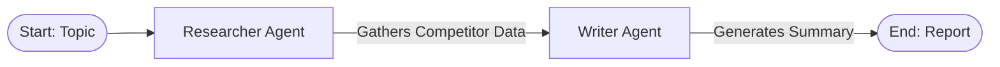

# Lab 8: Collaborative Agents with Google ADK 👥

Welcome to Lab 8! In this lab, we build a collaborative, multi-agent system using the **Google Agent Development Kit (ADK)**. You will learn how to define specialized agents, write reusable Python tool functions, and choreograph them in a sequential team workflow.

---

## 🎯 Learning Objectives
- Install and configure the **Google ADK** Python library.
- Define custom agent capabilities using modular Python **Tools** with clear docstring metadata.
- Instantiate specialized **Agents** containing targeted instructions and capabilities.
- Construct a **Workflow** choreographing sequential execution and context delegation between agents.
- Execute the agent runner in mock (simulated) and live model modes.

---

## ⚙️ How it Works

### 1. Collaborative Sequential Pipeline
In this lab, we model a digital writing team containing a Researcher and a Writer. They collaborate to create a competitor analysis report:



1.  **Researcher Agent**: Equipped with a web search tool. Its mission is to gather raw competitor details matching the target topic.
2.  **Writer Agent**: Equipped with no external tools. Its mission is to take raw research notes and write a clean, executive market intelligence summary.
3.  **Sequential Workflow**: Connects the output of the Researcher directly as the input of the Writer, ensuring clean context delegation.

---

## 🚀 Running the Lab

### Run instructions
Navigate to the lab directory:
```bash
cd labs/lab-08-google-adk
```

Run the agent script:
```bash
python3 agent.py
```

### Modes of Operation
- **Default Mode**: If `GEMINI_API_KEY` is not present, the script executes in a simulated runner mode. It outputs the exact sequence of tool executions and agent handoffs that would occur in a live Google ADK run, showing you the framework architecture without requiring billing keys.
- **Live Mode**: Set your API key in the environment to connect it to Google Gemini models to drive the live ADK framework execution:
  ```bash
  export GEMINI_API_KEY="your-gemini-api-key"
  python3 agent.py
  ```
