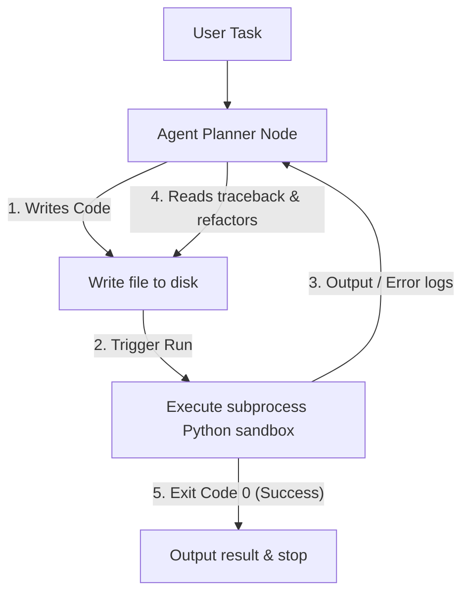

# Capstone Project 1: Autonomous Sandbox Dev Team 🖥️

Welcome to Capstone Project 1! In this project, we construct an **Autonomous Software Developer Agent** that writes Python script files, runs them in a sandboxed execution runtime, parses tracebacks to self-correct compilation/syntax errors, and iterates until the script runs successfully.

---

## 🎯 Project Goal
Build a self-correcting development loop. The agent acts as an autonomous coder:
1. Receives a user feature description.
2. Writes a Python implementation script.
3. Spawns a sandbox subprocess to execute the script.
4. If a bug or traceback is returned, the agent reasons about the error, refactors the code, and re-executes.
5. Continues iterating until the script exits with success code `0`.

---

## 📂 Code Files
- [**agent.py**](agent.py) — The main developer agent script containing file writing methods, execution sandboxes, and loop conditions.

---

## ⚙️ Architecture & Self-Correction Flow



---

## 🚀 Running the Project

### Run instructions
Navigate to the project directory:
```bash
cd projects/project-01-sandbox-dev-team
```

Run the agent script:
```bash
python agent.py
```

### Modes of Operation
- **Default Mode**: If `GEMINI_API_KEY` is not present, the script executes using a simulated self-correction cycle. The agent writes a script with an intentional syntax error (missing colon), captures the error output, writes the corrected code, and successfully executes it.
- **Live Mode**: Set your API key in the environment to connect it directly to Google Gemini models to drive the live coding agent:
  ```bash
  export GEMINI_API_KEY="your-gemini-api-key"
  python agent.py "Write a script calculating prime numbers up to 50"
  ```
