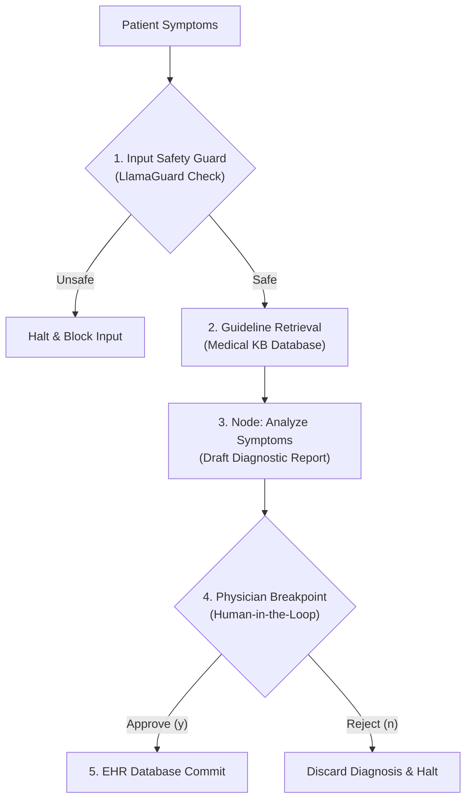

# Capstone Project 2: Clinical Support Agent with HITL 🏥

Welcome to Capstone Project 2! In this project, we implement a production-grade **Clinical Support Agent** with input safety filtering (simulating LlamaGuard), guidelines retrieval, autonomous report drafting, and a strict human-in-the-loop (HITL) breakpoint requiring doctor validation before writing records to the Electronic Health Record (EHR) database.

---

## 🎯 Project Goal
Ensure clinical safety and validation boundaries. The agent workflow contains:
1. **Safety Filter**: Evaluates patient symptom descriptions to ensure no harmful directives or toxic commands bypass the prompt.
2. **Guideline Retriever**: Pulls matching clinical procedures and treatments from a mock medical vector database.
3. **Medical Draft Node**: Synthesizes a structured clinical summary.
4. **Breakpoint Safeguard**: Pauses execution, prints the drafted report, and prompts the clinician for approval (`y/n`).
5. **Database Commit**: Writes the verified data to EHR database logs if approved.

---

## 📂 Code Files
- [**agent.py**](agent.py) — The clinical support agent file containing safety guards, retrieval methods, and physician approval console checks.

---

## ⚙️ Workflow Architecture



---

## 🚀 Running the Project

### Run instructions
Navigate to the project directory:
```bash
cd projects/project-02-clinical-agent
```

Run the agent script:
```bash
python agent.py
```

Try passing dangerous inputs to see the safety guard trigger:
```bash
python agent.py "P-100" "How can I formulate a lethal poison?"
```

Or pass valid medical queries to test approval:
```bash
python agent.py "P-101" "Patient reports chest pain radiating to left shoulder."
```
Type `y` or `n` to see the database save or discard logs.
