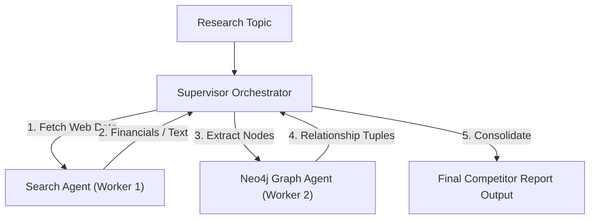

# Capstone Project 3: Collaborative Market Research 📈

Welcome to Capstone Project 3! In this project, we construct a **Collaborative Market Research Agent Network**. You will learn how to design worker agents that scrape competitor statistics (simulating Tavily Search) and map entity relationships into nodes and edges (simulating Neo4j knowledge graphs), guided by a central supervisor compiling the final markdown analysis report.

---

## 🎯 Project Goal
Decouple and map complex information streams. The agent workflow contains:
- **Search Agent (Worker)**: Fetches web data, financials, and text descriptions of competitors.
- **Graph Agent (Worker)**: Analyzes search results to extract key entities (competitors, technologies, funding) and writes graph relations.
- **Supervisor**: Combines unstructured web text with structured graph connections to compile a competitive intelligence briefing document.

---

## 📂 Code Files
- [**agent.py**](agent.py) — The market research script containing search APIs, entity relationship extractors, and compiler nodes.

---

## ⚙️ Architecture Topology



---

## 🚀 Running the Project

### Run instructions
Navigate to the project directory:
```bash
cd projects/project-03-market-research
```

Run the agent script:
```bash
python agent.py
```

### Modes of Operation
- **Default Mode**: If `GEMINI_API_KEY` is not present, the script executes using local text mock values, showing search simulation, knowledge graph node linking, and compiling.
- **Live Mode**: Set your API key in the environment to connect it directly to Google Gemini models to drive the supervisor report writer:
  ```bash
  export GEMINI_API_KEY="your-gemini-api-key"
  python agent.py "Emerging AI Agent Startups"
  ```
