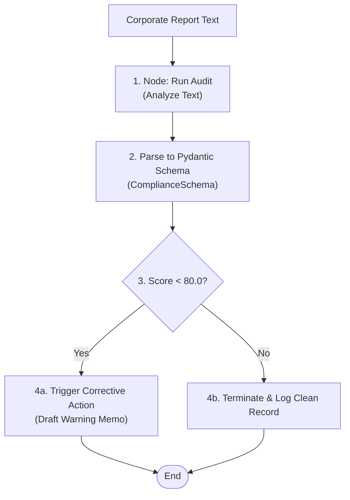

# Capstone Project 4: Compliance & Risk Auditor 🛡️

Welcome to Capstone Project 4! In this project, we implement an **Autonomous Corporate Compliance & Risk Auditor**. You will learn how to write schemas using Pydantic, parse unstructured corporate reports into structured JSON objects, check threshold boundaries, and trigger automatic business corrective actions (like drafting warning notices) when compliance violations are found.

---

## 🎯 Project Goal
Automate regulatory compliance. The agent workflow contains:
1. **Auditor Node**: Analyzes text documents (reports, emails, logs) and extracts details according to a strict Pydantic structure (`ComplianceSchema`).
2. **Pydantic Validation**: Guarantees that score, violated clauses, and recommendations are parsed cleanly.
3. **Corrective Action Handler**: Triggers administrative workflows (sending memo alerts) if the compliance score falls below the `80%` threshold.

---

## 📂 Code Files
- [**agent.py**](agent.py) — The compliance risk script containing schemas, document parsing nodes, and corrective warning memo functions.

---

## ⚙️ Workflow Architecture



---

## 🚀 Running the Project

### Run instructions
Navigate to the project directory:
```bash
cd projects/project-04-compliance-auditor
```

Run the agent script:
```bash
python agent.py
```

### Modes of Operation
- **Default Mode**: If `GEMINI_API_KEY` is not present, the script executes using local simulated values, showing audit logs, compliance violations, and warning memo drafting.
- **Live Mode**: Set your API key in the environment to connect it directly to Google Gemini models to drive the live document auditing:
  ```bash
  export GEMINI_API_KEY="your-gemini-api-key"
  python agent.py "Security check report: All databases are encrypted at rest. No violations detected."
  ```
